# zivo


---
[English](README.md) | [日本語](README.ja.md)
---

zivo は、操作を覚えなくても直感的に使える TUI ファイルマネージャです。ファイルの閲覧、検索、操作をコマンドを暗記することなく行えます — Zero-friction Interface for Viewing & Operations。

zivo は、複雑な設定やプラグイン導入、スクリプトの作成なしに誰でも簡単に使えることを目指しています。何でもできることは目指しておらず、よくおこなう操作を快適に簡単にできることを目指しています。

- **覚えなくてOK**: よく使う操作はヘルプバーに常に表示
- **迷っても安心**: コマンドパレットからすべての操作を呼び出し可能
- **見やすい 3 ペイン**: 親・現在・右ペインを並べ、テキスト・画像・ドキュメントをその場でプレビュー
- **Transfer モード**: 2 ディレクトリを並べて、ファイルのコピーや移動を簡単に操作可能
- **タブ対応**: 1つの TUI の中で複数のブラウズ状態を開いたまま切り替え可能
- **強力な検索**: 再帰ファイル検索と grep 検索で目的のファイルに即座にジャンプ
- **ターミナルエディタ連携**: カレントディレクトリで既定のターミナルエディタを起動可能
- **外部アプリで開く**: ファイルを既定のアプリケーションでそのままオープン可能

## 特徴

- 親 / 現在 / 右ペインを並べたシンプルな 3 ペイン表示です。カーソルがディレクトリ上にあるときは右ペインに子要素一覧を表示し、一般的なテキストファイル上にあるときは右ペインに構文色分け付きのテキストプレビューを表示します。一般的な画像形式は `chafa` による文字ベースプレビューとして表示でき、`pdf`、`docx`、`xlsx`、`pptx` も右ペインでプレビューできます。ディレクトリ移動、複数選択、コピー、カット、貼り付け、直前の可逆ファイル操作の Undo、ゴミ箱への移動、ファイル削除、パスのコピー、リネーム、新規作成、アーカイブの展開、zip 圧縮、選択ファイル群に対する文字列置換プレビュー、ファイル検索、grep 検索、1 行シェルコマンド実行をキーボードだけで操作できます。よく使う操作は画面下部のヘルプバーに常時表示しています。

  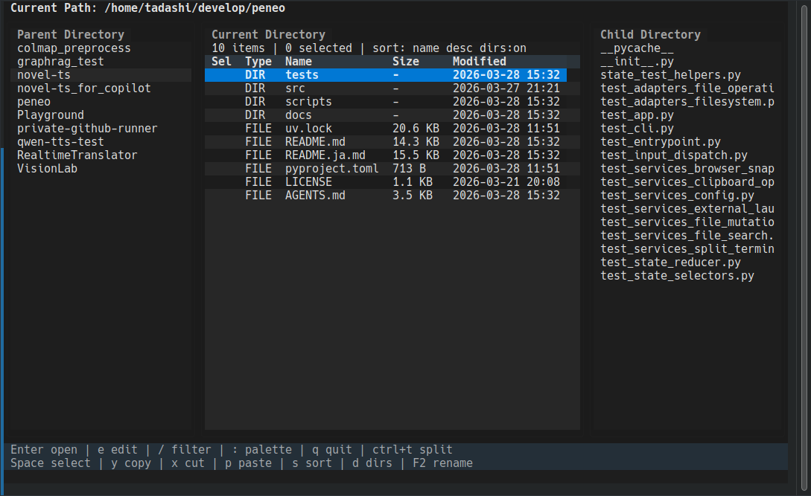

- 使用頻度の低い操作はコマンドパレットに集約しています。キーバインドを覚えていなくても、コマンドパレットから目的の操作を簡単に実行できます。

  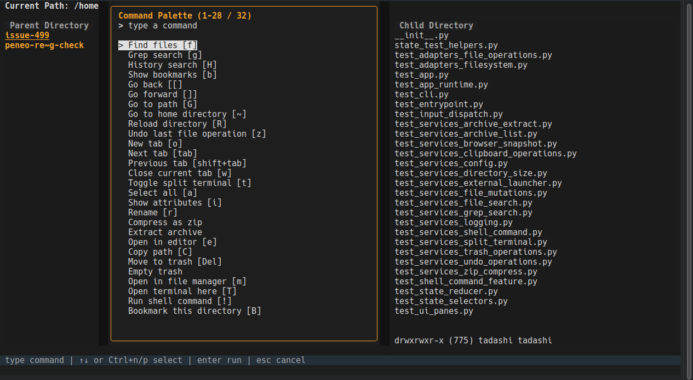

- テキストファイル、pdf、docx、xlsx、pptx の冒頭のプレビュー表示が可能です。これにより、ファイルを開かなくてもファイルの概要を確認することができます。プレビューはファイル先頭 64 KiB までです。

  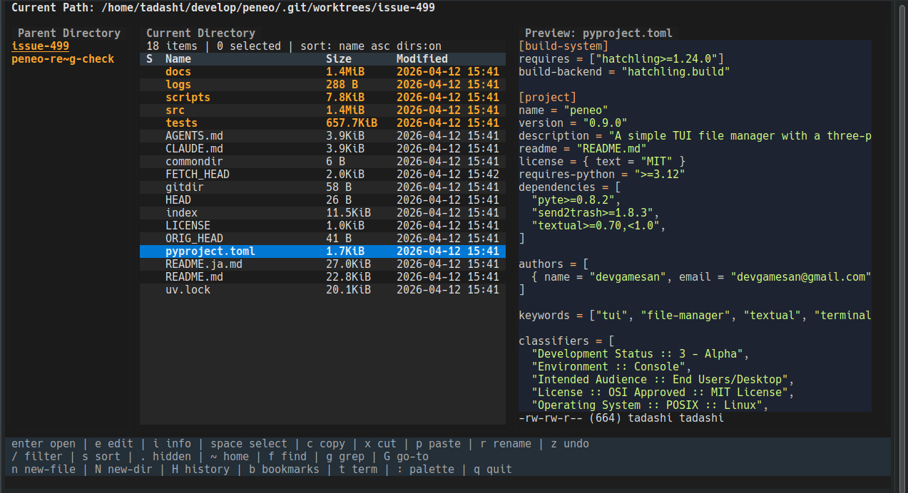

- 画像は chafa による文字ベースプレビューとして表示できます。

  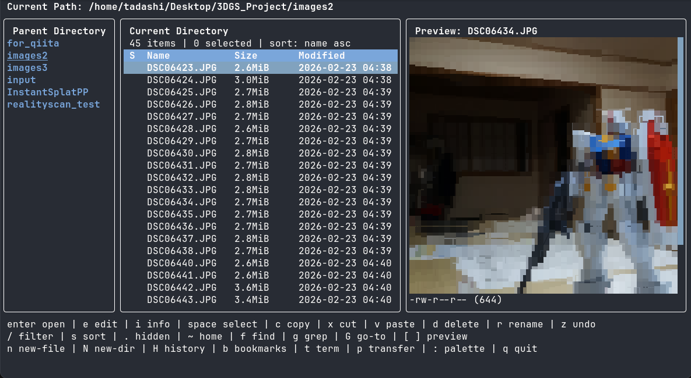


- 複数タブを使うと、別々の作業ディレクトリを 1 つの zivo セッション内で開いたまま維持できます。新規タブ作成、前後タブへの切り替え、現在タブのクローズを TUI のままで行えます。

  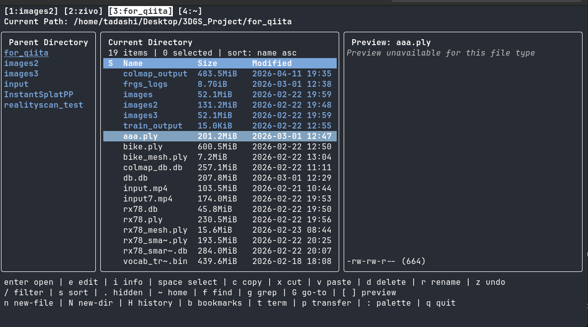

- 左右にディレクトリを並べてコピー・移動できる 2 ペイン転送レイアウトにも切り替えられます。

  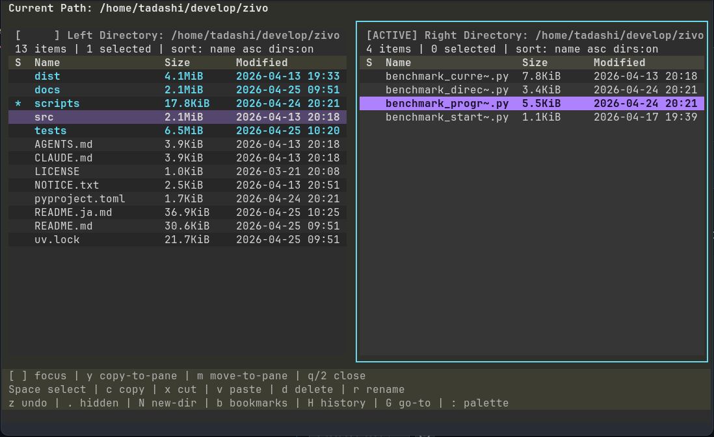

- `!` を押すと、現在のディレクトリで1行シェルコマンドを実行できます。コマンドの実行結果をステータスバーに表示し、zivo のセッションを維持したまま軽微な作業を行いたい場合に便利です。

  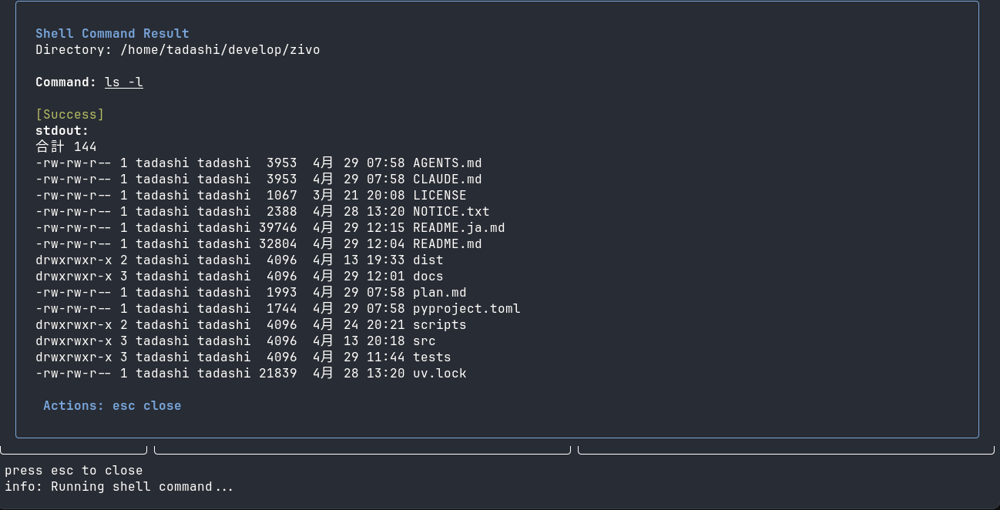

- ファイル検索機能により、簡単に目的のファイルにジャンプすることができます。膨大なファイルの中から、名前の一部を入力するだけで目的のファイルを即座にフィルタリングし、階層を深く辿ることなく、最短ルートでファイルにアクセスできます。また、検索結果のファイルのプレビュー表示が可能であり、目的のファイルを簡単に見つけられます。

  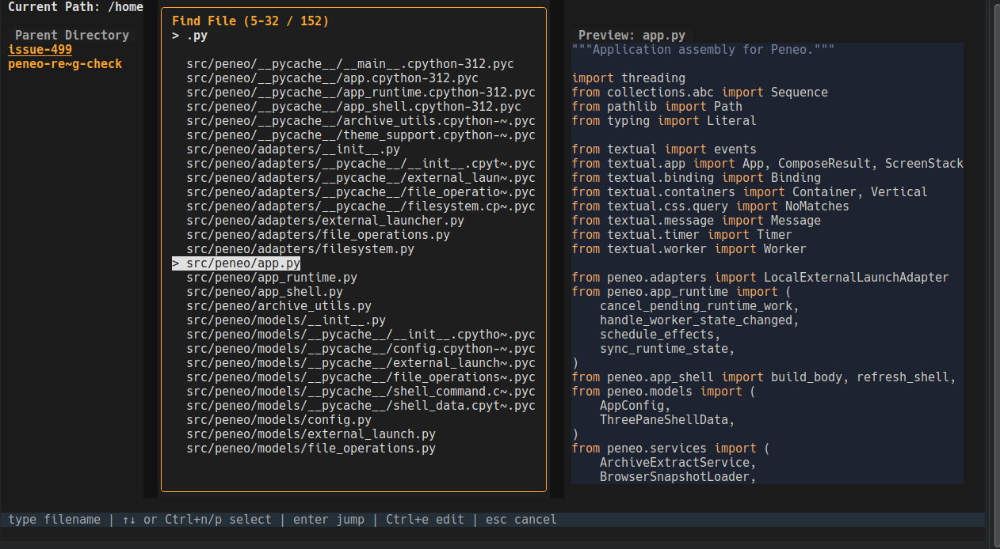

- カレントディレクトリ配下を対象とした再帰 grep 検索が可能です。検索結果から該当ファイルへジャンプできます。差分箇所の前後数行をプレビューでき、目的のファイルを簡単に見つけることができます。パレットには `Filter: Filename`、`Include extensions`、`Exclude extensions` があり、開く前にファイル名や拡張子で対象を絞り込めます。また、ターミナルエディタまたは GUI エディタで該当箇所を直接開くこともできます。

  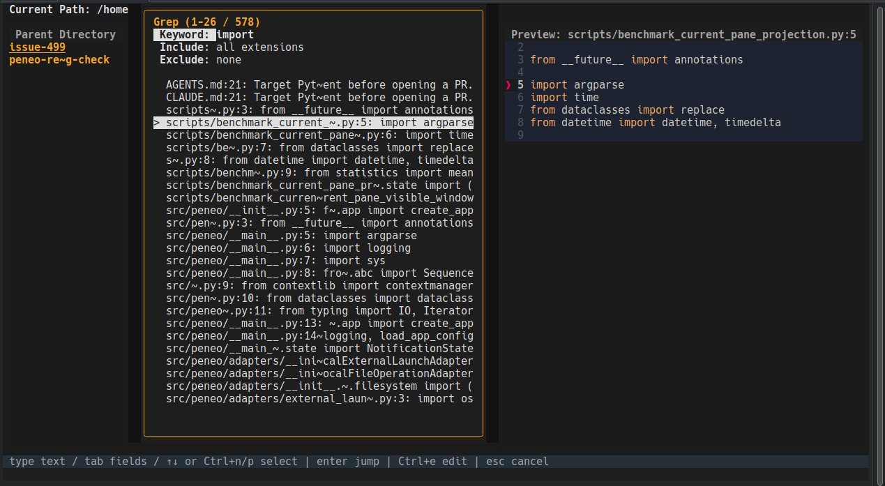

- 選択したファイルおよび検索でヒットしたファイルに対して、文字列置換のプレビューと実行が可能です。右ペインに diff プレビューを表示し、置換前後の変更を確認してから一括置換を実行できます。選択ファイル、ファイル検索結果、grep 検索結果など、複数の方法で置換対象ファイルを指定できます。また、filename や拡張子で対象を絞り込んだり、keyword で grep 検索してから置換したりできます。誤操作を防ぐため、置換前にプレビューで必ず確認できます。

  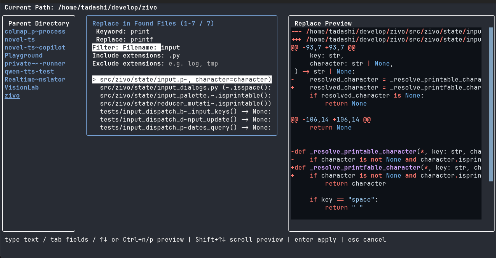

- フィルタ入力、ソート切り替えをサポートしています。次は、`.py`という文字列でフィルタして、最終更新時刻で降順でソートした例です。

  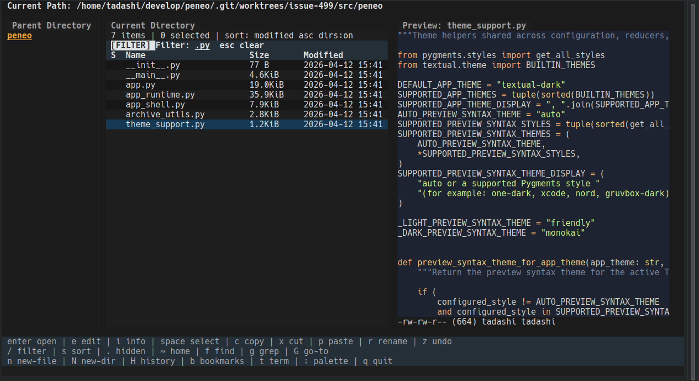

- ブックマーク機能をサポートしており、登録したディレクトリに即座にジャンプすることができます。

  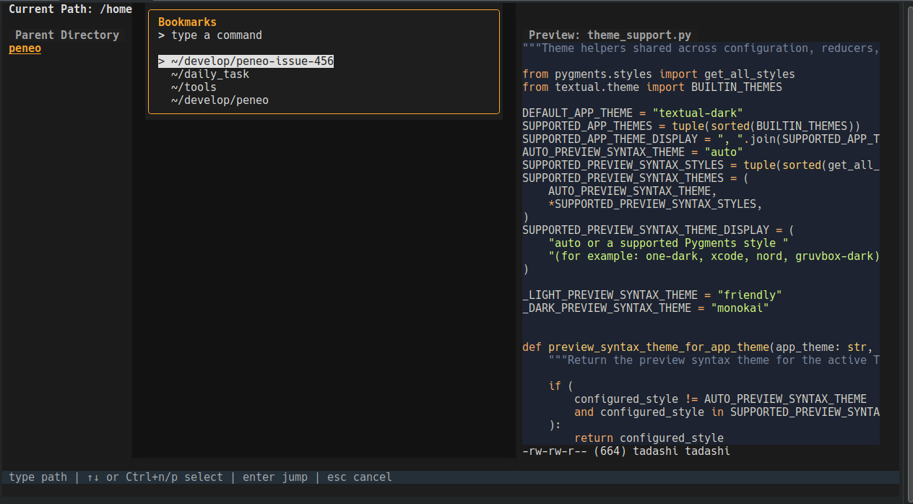

- 履歴機能をサポートしており、最近アクセスしたディレクトリに即座にジャンプできます。

  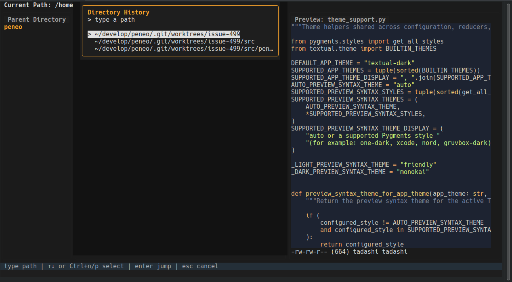

- ファイルにカーソルを合わせた状態で `e` を押すと、現在のターミナル上でターミナルエディタへ切り替えられます。`O` を押すと、VS Code など設定済みの GUI エディタでフォーカス中ファイルを開けます。`nvim`、`vim`、`nano` などのエディタでシームレスに切替可能です。次は、zivoから`Vim`を開いた例です。

  

- `t` を押すと、zivo が一時停止し、現在のターミナルで対話シェルをフォアグラウンドで開きます。`exit` でシェルを終了すると zivo が自動で再開するため、別ウィンドウやターミナル multiplexer の管理が不要です。一時的なコマンド実行やディレクトリ操作を、zivo のセッションを維持したまま行いたい場合に便利です。

- 複数のテーマからお好みの見た目を選択することが可能です。

  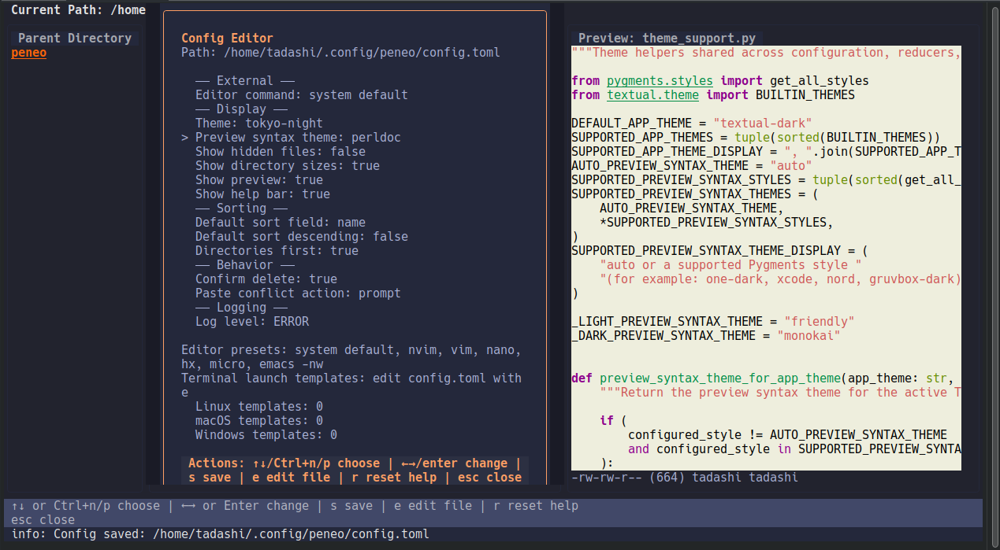  
  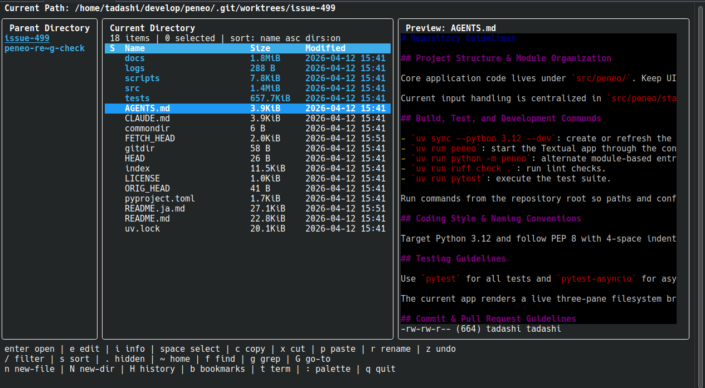

- ファイルやディレクトリは OS の既定アプリで開けます。例えば、カレントディレクトリを OS のファイルマネージャで開いたり、OS 側の関連付けに応じてファイルを VS Code などで開いたりできます。また、既定のターミナルを別ウィンドウで起動することもできます。

## サポートOS

| OS | サポート状況 | 備考 |
| --- | --- | --- |
| Ubuntu | サポート | 現時点で主要な動作確認対象です。 |
| Ubuntu (WSL) | サポート | WSL 上の Ubuntu を動作確認対象としています。 |
| macOS | サポート | ゴミ箱操作にはターミナルへのフルディスクアクセス権限が必要です。 |
| Windows | サポート | ドライブ移動、ファイル操作、クリップボード、シェルコマンド、外部ターミナル、undo などほとんどの機能を利用できます。`zivo-cd` は Windows では未対応です。 |

## インストール

### 前提: uv のインストール

zivo はパッケージマネージャとして [uv](https://docs.astral.sh/uv/) を使用します。まだインストールしていない場合は、先に uv をインストールしてください。

```bash
curl -LsSf https://astral.sh/uv/install.sh | sh
```

その他のインストール方法については [uv 公式ドキュメント](https://docs.astral.sh/uv/getting-started/installation/) を参照してください。

### PyPI からインストール

`uv` が入っている環境で、PyPI から直接インストールできます。

```bash
uv tool install zivo
```

### リポジトリからインストール

または、リポジトリを clone してからツールとしてインストールします。

```bash
git clone https://github.com/devgamesan/zivo.git
cd zivo
uv tool install --from . zivo
```

更新時は最新を pull したあとに同じコマンドを再実行してください。

### 依存ツール

zivo 本体の起動は `uv` だけで行えますが、一部の機能は `PATH` 上の外部コマンドに依存します。利用する OS / 環境ごとに必要なものは次のとおりです。

| 機能 | Ubuntu / Debian | Ubuntu (WSL) | macOS | Windows |
| --- | --- | --- | --- | --- |
| ドキュメントプレビュー (`docx` / `xlsx` / `pptx`) | `pandoc` 3.8.3+ | `pandoc` 3.8.3+ | `pandoc` 3.8.3+ | `pandoc` 3.8.3+ |
| 画像プレビュー (`png` / `jpg` / `gif` / `webp` など) | `chafa` | `chafa` | `chafa` | `chafa` |
| PDFプレビュー (`pdf`) | `poppler-utils` | `poppler-utils` | `poppler` | `poppler` (pdftotext) |
| grep 検索 (`g`) | `ripgrep` | `ripgrep` | `ripgrep` | `ripgrep` |
| パスコピー (`C`) | X11: `xclip` / Wayland: `wl-clipboard` | 通常は不要 (`clip.exe`)、必要なら `xclip` / `wl-clipboard` | 不要 (`pbcopy` 組み込み) | 組み込み |
| GUI 連携コマンド | 不要 | `wslu` 推奨 | 不要 | 組み込み |

**注**: 一部のディストリビューションでは、パッケージマネージャー経由でpandoc 3.8.3以上が提供されない場合があります。インストールされたバージョンが3.8.3より古い場合は、公式pandocウェブサイトから最新版を手動でインストールしてください：https://pandoc.org/installing.html

インストール例:

```bash
# Ubuntu / Debian (X11)
sudo apt install chafa pandoc poppler-utils ripgrep xclip

# Ubuntu / Debian (Wayland)
sudo apt install chafa pandoc poppler-utils ripgrep wl-clipboard

# Ubuntu (WSL)
sudo apt install chafa pandoc poppler-utils ripgrep wslu

# macOS
brew install chafa pandoc poppler ripgrep
```

### Windows

Windows では、ドライブルート（`C:\` など）で `←` を押すとドライブ一覧に戻り、zivo を離れずにドライブを切り替えられます。

依存ツールは各公式サイトからインストールしてください。

- ドキュメントプレビュー: [pandoc](https://pandoc.org/)
- 画像プレビュー: [chafa](https://hpjansson.org/chafa/)
- PDFプレビュー (`pdftotext`): [poppler for Windows](https://github.com/oschwartz10612/poppler-windows)
- grep 検索: [ripgrep](https://github.com/BurntSushi/ripgrep)

macOS では、使用しているターミナルアプリに **フルディスクアクセス** 権限を付与してください。**システム設定 > プライバシーとセキュリティ > フルディスクアクセス** を開き、zivo を実行するターミナルアプリ（Terminal.app、iTerm2、Alacritty など）を有効にしてください。この権限がない場合、`~/.Trash` などの保護されたディレクトリにアクセスする操作が失敗します。

## 起動

```bash
zivo
```

`zivo` 単体では親シェルのカレントディレクトリを変更できません。終了時に最後に見ていたディレクトリへ親シェルも追従させたい場合は、先に shell integration を読み込みます。

```bash
eval "$(zivo init bash)"  # bash 用
eval "$(zivo init zsh)"   # zsh 用
```

**注**: シェル統合 (`zivo-cd`) は現在 Windows ではサポートされていません。Windows では通常の `zivo` を使用してください。

これにより `zivo-cd` というシェル関数が定義されます。終了後に親シェルを最後のディレクトリへ `cd` させたいときは、`zivo` ではなく `zivo-cd` で起動します。

```bash
zivo-cd
```

ディレクトリ追従が不要な場合は、従来どおり `zivo` を使ってください。

ファイルにカーソルを合わせた状態で `e` を押すと、現在のターミナル上でターミナルエディタへ切り替えられます。`config.toml` の `editor.command` が設定されていればそれを優先し、未設定なら `$EDITOR`、さらに `nvim`、`vim`、`nano` などの組み込み候補へフォールバックします。

## キーバインディング

### 通常モード

zivo から直接外部ターミナルを開けます。`t` を押すと zivo が一時停止し、現在のターミナルで zivo のカレントディレクトリを起点に対話シェルを開きます。シェルを終了すると zivo が自動で再開するため、ディレクトリ移動や複数ターミナルの管理が不要です。または `T` で別ウィンドウでターミナルを開きます。

| キー | 動作 |
| --- | ------ |
| `j` / `↓` | 下へ移動 |
| `PageUp` / `PageDown` | 1 ページ分カーソル移動 |
| `k` / `↑` | 上へ移動 |
| `Home` / `End` | 先頭/末尾のエントリへ移動 |
| `h` / `←` / `Backspace` | 親ディレクトリへ移動 |
| `l` / `→` | ディレクトリに入る |
| `Shift+↑` / `Shift+↓` | 選択範囲を拡張 |
| `Enter` | ファイルを開く / ディレクトリに入る |
| `Space` | 選択トグル後に次行へ移動 |
| `a` | 表示中の全エントリを選択 |
| `Esc` | 選択解除 / フィルタ解除 |
| `c` | 選択項目をコピー |
| `x` | 選択項目をカット |
| `v` | クリップボードから貼り付け |
| `z` | 直前の Undo 対象ファイル操作を取り消し |
| `C` | パスをクリップボードにコピー |
| `r` | 選択項目をリネーム |
| `n` | 新規ファイル作成 |
| `N` | 新規ディレクトリ作成 |
| `d` | 選択項目をゴミ箱へ移動 |
| `D` | 選択項目を完全に削除 |
| `Delete` | 選択項目をゴミ箱へ移動（macOS では fn + Delete） |
| `Shift+Delete` | 選択項目を完全に削除（macOS では fn + Shift + Delete） |
| `i` | ファイル属性を表示 |
| `e` | ファイルをターミナルエディタで開く |
| `O` | ファイルを GUI エディタで開く |
| `!` | シェルコマンドを実行 |
| `f` | ファイル検索（再帰検索） |
| `g` | grep 検索 |
| `/` | ファイルをフィルタ |
| `H` | 履歴を表示 |
| `b` | ブックマークを表示 |
| `B` | 現在のディレクトリのブックマークを切り替え |
| `G` | パスに移動 |
| `~` | ホームディレクトリに移動 |
| `.` | 隠しファイル表示を切り替え |
| `s` | ソート順を循環切り替え |
| `R` | ディレクトリを再読み込み |
| `t` | ターミナルをフォアグラウンドで開く（zivo を一時停止し、現在のターミナルでシェルを開く。exit で zivo に戻る） |
| `T` | 現在のディレクトリでターミナルを開く（別ウィンドウ） |
| `o` | 新しいタブを開く |
| `w` | 現在のタブを閉じる |
| `tab` | 次のタブへ切り替える |
| `shift+tab` | 前のタブへ切り替える |
| `1`〜`0` | 数字キーで対応するタブへ切り替える（1が最初のタブ、0が10番目のタブ） |
| `M` | 現在のディレクトリをファイルマネージャで開く |
| `:` | コマンドパレットを開く |
| `q` | 終了 |
| `[` | 右ペインのテキストプレビューを 1 ページ上へスクロール |
| `]` | 右ペインのテキストプレビューを 1 ページ下へスクロール |
| `{` | 履歴を戻る |
| `}` | 履歴を進む |
| `2` | 2 ペイン転送モードを切り替え |

### 転送モード

| キー | 動作 |
| --- | ------ |
| `Esc` | 通常モードに戻る / 選択解除 |
| `[` / `]` | 左右の転送ペインへフォーカスを移動 |
| `j` / `↓` | フォーカス中ペインで下へ移動 |
| `k` / `↑` | フォーカス中ペインで上へ移動 |
| `PageUp` / `PageDown` | フォーカス中ペインで 1 ページ分移動 |
| `Home` / `End` | フォーカス中ペインの先頭/末尾の表示エントリへ移動 |
| `h` / `←` | フォーカス中ペインで親ディレクトリへ移動 |
| `~` | フォーカス中ペインでホームディレクトリへ移動 |
| `l` / `→` / `Enter` | フォーカス中ペインでディレクトリに入る |
| `Space` | フォーカス中ペインで選択を切り替えて下へ移動 |
| `Shift+↑` / `Shift+↓` | フォーカス中ペインで選択範囲を拡張 |
| `a` | フォーカス中ペインの表示エントリをすべて選択 |
| `c` | 選択項目をクリップボードへコピー |
| `x` | 選択項目をクリップボードへ切り取り |
| `v` | クリップボードからフォーカス中ペインへ貼り付け |
| `y` | フォーカス中ペインの対象を反対側ペインへコピー（copy-to-pane） |
| `m` | フォーカス中ペインの対象を反対側ペインへ移動（move-to-pane） |
| `d` | フォーカス中ペインの対象をゴミ箱へ移動 |
| `r` | フォーカス中または単一選択中のエントリをリネーム |
| `z` | 直前のファイル操作を取り消し |
| `.` | 隠しファイル表示を切り替え |
| `N` | フォーカス中ペインで新規ディレクトリ作成 |
| `b` | ブックマークを表示 |
| `H` | 履歴を表示 |
| `:` | Transferモードで使えるコマンドだけを並べたコマンドパレットを開く |
| `o` | 新しいタブを開く |
| `w` | 現在のタブを閉じる |
| `tab` | 次のタブへ切り替える |
| `shift+tab` | 前のタブへ切り替える |
| `1`〜`0` | 数字キーで対応するタブへ切り替える（1が最初のタブ、0が10番目のタブ） |
| `p` / `Esc` | 通常モードに戻る |
| `q` | アプリを終了 |

### 入力ダイアログ

| キー | 動作 |
| --- | ------ |
| `Enter` | 確定 |
| `Esc` | キャンセル |
| `Tab` | 補完（対応箇所） |
| `Ctrl+v` | クリップボードから貼り付け |

### 検索結果モード（ファイル検索 / grep 検索）

| キー | 動作 |
| --- | ------ |
| `↑` / `↓` | 結果一覧のカーソル移動 |
| `Ctrl+n` / `Ctrl+p` | 結果一覧のカーソル移動（下/上） |
| `PageUp` / `PageDown` | 1 ページ分カーソル移動 |
| `Home` / `End` | 先頭/末尾の結果へ移動 |
| `Enter` | 選択中の結果を開く |
| `Ctrl+e` | 選択中の結果をエディタで開く |
| `Ctrl+o` | 選択中の結果を GUI エディタで開く |
| `Esc` | 検索を閉じる |

**注**: 検索結果モードでは矢印キーでナビゲートします。`j`/`k` キーは検索クエリの入力に使用されます。

### フィルタモード

| キー | 動作 |
| --- | ------ |
| 文字入力 | フィルタ文字列を更新 |
| `Backspace` | 1 文字削除 |
| `Enter` / `↓` | フィルタを適用して一覧操作へ戻る |
| `Esc` | フィルタを解除 |

### コマンドパレットモード

| キー | 動作 |
| --- | ------ |
| 文字入力 / `↑` / `↓` / `Ctrl+n` / `Ctrl+p` / `k` / `j` / `Enter` / `Esc` | コマンドを絞り込み、選択、実行、キャンセル。`Find files` と `Grep search` では `j` / `k` は文字入力として扱われ、結果のナビゲーションには `↑` / `↓` または `Ctrl+n` / `Ctrl+p` を使用します。 |

`Replace text` のプレビューが右ペインに表示されている間は、`Shift+↑` / `Shift+↓` でそのプレビューをスクロールできます。（この説明は `Replace text in selected files`、`Replace text in found files`、`Replace text in grep results`、`Grep and replace in selected files` すべてに適用されます）

### 設定エディタモード

| キー | 動作 |
| --- | ------ |
| `↑` / `↓` / `Ctrl+n` / `Ctrl+p` | 設定項目を移動 |
| `←` / `→` / `Enter` | 選択中の値を変更 |
| `s` | `config.toml` を保存 |
| `e` | 生の設定ファイルをターミナルエディタで開く |
| `r` | ヘルプバー文言を組み込み既定値へ戻す |
| `Esc` | 設定エディタを閉じる |

### 名前入力モード

| キー | 動作 |
| --- | ------ |
| 文字入力 / `Backspace` / `Enter` / `Esc` | リネームや新規作成の入力値を編集、確定、キャンセル |

### 確認ダイアログモード

| キー | 動作 |
| --- | ------ |
| `Enter` / `Esc` | ゴミ箱削除 / 完全削除の確認を確定 / 中止 |
| `o` / `s` / `r` / `Esc` | 貼り付け競合を overwrite / skip / rename / cancel |

## コマンドパレット

使用頻度の低い操作は `:` で開くコマンドパレットにまとめています。現在使える主なコマンドは次のとおりです。
Transferモードでは、アクティブな転送ペインで実行できるコマンドだけをコマンドパレットに表示します。
タブバーは 2 タブ以上開いている場合にだけ表示されます。

| コマンド | 表示条件 | 動作 / 補足 |
| --- | --- | --- |
| `New tab` | 常に表示 | 現在ディレクトリを初期値にした新しいブラウズタブを開きます。`o` でも実行できます。 |
| `Next tab` | 2 タブ以上開いているとき | 次のブラウズタブへ切り替えます。`tab` でも実行できます。 |
| `Previous tab` | 2 タブ以上開いているとき | 前のブラウズタブへ切り替えます。`shift+tab` でも実行できます。 |
| `Close current tab` | 2 タブ以上開いているとき | アクティブなブラウズタブを閉じます。最後の 1 タブは閉じられません。`w` でも実行できます。 |
| `Find files` | 常に表示 | 再帰ファイル検索を開きます。 |
| `Grep search` | 常に表示 | 再帰 grep 検索を開きます（`ripgrep` / `rg` が `PATH` 上に必要）。keyword / filename / include extension / exclude extension の各フィルタを利用できます。 |
| `Grep in selected files` | カレントディレクトリでファイルが1つフォーカスされているか、1つ以上のファイルが選択されているとき | 選択されたファイル、または何も選択されていない場合はフォーカスされたファイルに限定してgrep検索を開きます。キーワードを入力してgrep検索を行い、一致した行がパレットに表示されます。`↑` / `↓` または `Ctrl+n` / `Ctrl+p` で結果間を移動し、`Enter` でファイルへナビゲートし、`Ctrl+e` でターミナルエディタ、`Ctrl+o` で GUI エディタの該当箇所を開きます。 |
| `History search` | 常に表示 | ディレクトリ履歴リストを開き、選択したディレクトリへ移動します。 |
| `Show bookmarks` | 常に表示 | 保存済みのブックマークリストを開き、選択したディレクトリへ移動します。 |
| `Go back` | ディレクトリ履歴に戻り先があるとき | 履歴を一つ戻ります。 |
| `Go forward` | ディレクトリ履歴に進み先があるとき | 履歴を一つ進みます。 |
| `Go to path` | 常に表示 | 特定のパスへ移動するための入力を開き、一致するディレクトリ候補表示と `Tab` 補完を使えます。 |
| `Go to home directory` | 常に表示 | ホームディレクトリへ移動します。 |
| `Reload directory` | 常に表示 | 現在ディレクトリを再読み込みします。 |
| `Toggle transfer mode` / `Close transfer mode` | 常に表示 | 通常の 3 ペインブラウザと 2 ペイン転送レイアウトを切り替えます。転送モード中は `p` / `Esc`、通常モードからは `p` でも実行できます。 |
| `Undo last file operation` | Undo 履歴があるとき | 直前の Undo 対象リネーム、貼り付け、ゴミ箱移動を取り消します。`z` でも実行できます。 |
| `Select all` | 現在ディレクトリに表示中の項目が 1 件以上あるとき | 現在ディレクトリで表示中の項目をすべて選択します。 |
| `Replace text in selected files` | ファイルがフォーカス中、または現在ディレクトリで 1 件以上のファイルが選択中のとき | 選択中のファイル、または未選択時はフォーカス中のファイルを対象に 2 フィールドの置換パレットを開きます。一致したファイル一覧がパレットに表示され、`↑↓` と `Ctrl+n` / `Ctrl+p` で移動すると右ペインに選択中ファイルの diff を表示します。`Enter` で一括置換を実行します。`Shift+↑` / `Shift+↓` で diff プレビューをスクロールします。 |
| `Replace text in found files` | 常に表示 | 3 フィールドの置換パレット（filename、find、replace）を開きます。ファイル名パターンでファイルを検索し、find/replace テキストで置換をプレビューします。`Tab` / `Shift+Tab` でフィールドを切り替えます。右ペインに diff プレビューを表示し、`Enter` で置換を適用します。 |
| `Replace text in grep results` | 常に表示 | 5 フィールドの置換パレット（keyword、replace、filename filter、include extensions、exclude extensions）を開きます。keyword は grep 検索語と置換対象テキストを兼ねます。keyword を入力して grep 検索し、replacement を入力して変更をプレビューします。filename と拡張子フィルターで対象ファイルを絞り込めます。`Tab` / `Shift+Tab` でフィールドを切り替えます。右ペインに diff プレビューを表示し、`Enter` で置換を適用します。 |
| `Grep and replace in selected files` | ファイルがフォーカス中、または現在ディレクトリで 1 件以上のファイルが選択中のとき | 選択中のファイル、または未選択時はフォーカス中のファイルを対象に 2 フィールドの置換パレット（keyword、replace）を開きます。keyword で grep 検索し、一致した行がパレットに表示されます。`Tab` / `Shift+Tab` でフィールドを切り替え、右ペインに diff プレビューを表示し、`Enter` で置換を適用します。 |
| `Show attributes` | 単一対象が選択中またはフォーカス中のとき | 読み取り専用の属性ダイアログを開きます。`i` でも実行できます。 |
| `Rename` | 単一対象が選択中またはフォーカス中のとき | 単一対象のリネーム入力を開始します。 |
| `Compress as zip` | 対象が 1 件以上あるとき | 選択中の項目、または未選択時はフォーカス中の項目を zip 圧縮します。 |
| `Extract archive` | 単一の対応アーカイブファイルが選択中またはフォーカス中のとき | `.zip` / `.tar` / `.tar.gz` / `.tar.bz2` の展開を開始します。展開先入力は絶対パスと相対パスの両方に対応し、相対パスはアーカイブ親ディレクトリ基準で解決されます。初期値はアーカイブと同じ階層にある同名ディレクトリの絶対パスです。既存パスとの衝突がある場合は事前確認し、展開中は status bar に entry 件数ベースの進捗を表示します。 |
| `Open in editor` | 単一ファイルが選択中またはフォーカス中のとき | フォーカス中のファイルを `editor.command` -> `$EDITOR` -> 組み込み既定値の順でターミナルエディタで開きます。 |
| `Open in GUI editor` | 単一ファイルが選択中またはフォーカス中のとき | フォーカス中のファイルを設定済みの GUI エディタで開きます。`O` でも実行できます。 |
| `Copy path` | 対象が 1 件以上あるとき | 選択中のパス一覧、または未選択時はフォーカス中のパスをシステムクリップボードへコピーします。`C` でも実行できます。 |
| `Move to trash` | 対象が 1 件以上あるとき | 選択中の項目、またはフォーカス項目をゴミ箱へ移動します（既定では確認あり、設定で変更可能）。Windows では `send2trash` 経由で Recycle Bin を使います。 |
| `Empty trash` | 常に表示 | ゴミ箱内のすべての項目を完全に削除します。実行前に確認ダイアログを表示します。Windows では PowerShell の `Clear-RecycleBin` を使用してごみ箱を空にします。 |
| `Open in file manager` | 常に表示 | 現在ディレクトリを OS のファイルマネージャで開きます。`M` でも実行できます。 |
| `Open current directory in GUI editor` | 常に表示 | zivo の current directory を設定済みの GUI エディタで開きます。 |
| `Open terminal` | 常に表示 | `config.toml` の設定を優先しつつ、zivo の current directory を起点に外部ターミナルを起動します。`T` と `t` でも実行できます。 |
| `Run shell command` | 常に表示 | 1 行シェルコマンド入力ダイアログを開き、現在ディレクトリでバックグラウンド実行します。完了後は先頭の出力行、または失敗要約を status bar に表示します。Windows では `powershell.exe`、次に `pwsh`、最後に `cmd.exe` を優先するため、構文は選ばれた Windows shell に従います。`!` でも実行できます。 |
| `Bookmark this directory` / `Remove bookmark` | 常に表示 | 現在ディレクトリを `[bookmarks].paths` に追加または削除します。ラベルは現在状態を反映し、`B` でも切り替えられます。 |
| `Show hidden files` / `Hide hidden files` | 常に表示 | ブラウザ 3 ペインの隠しファイル表示を切り替えます。ラベルは現在状態を反映し、`.` でも切り替えられます。 |
| `Edit config` | 常に表示 | 起動時設定を編集するオーバーレイを開きます。優先ターミナルエディタ、外部ターミナル起動モード、隠しファイル表示、ディレクトリサイズ表示、テキストプレビュー表示、画像プレビュー表示、PDF プレビュー表示、Office プレビュー表示、テーマ、ソート、貼り付け競合時の既定動作、削除確認の有無などを編集できます。オーバーレイ内には選択中の設定が何を変えるかの説明も表示されるため、README を見返さなくても挙動を判断できます。テーマ変更はその場で即時プレビューされます。`↑` / `↓` または `Ctrl+n` / `Ctrl+p` で項目移動し、`←` / `→` / `Enter` で値変更、`s` で `config.toml` 保存、`e` で生の設定ファイルをターミナルエディタで開けます。 |
| `Create file` | 常に表示 | 現在ディレクトリで新規ファイル作成の入力を開始します。 |
| `Create directory` | 常に表示 | 現在ディレクトリで新規ディレクトリ作成の入力を開始します。 |

## 設定ファイル

zivo は起動時にユーザー設定用の `config.toml` を読み込みます。ファイルがまだ存在しない場合は、既定値入りの設定ファイルを自動生成します。

- Linux: `${XDG_CONFIG_HOME:-~/.config}/zivo/config.toml`
- macOS: `~/Library/Application Support/zivo/config.toml`
- Windows: `%APPDATA%\\zivo\\config.toml`

設定できる項目は次のとおりです。

| セクション | キー | 値 | 説明 |
| --- | --- | --- | --- |
| `terminal` | `linux` | shell 形式コマンド文字列の配列 | Linux 向けの任意ターミナル起動コマンドです。作業ディレクトリは `{path}` で埋め込みます。空文字や不正なエントリは無視されます。 |
| `terminal` | `macos` | shell 形式コマンド文字列の配列 | macOS 向けの任意ターミナル起動コマンドです。検証ルールは Linux と同じです。 |
| `terminal` | `windows` | shell 形式コマンド文字列の配列 | Windows / WSL 向けの任意ターミナル起動コマンドです。 |
| `editor` | `command` | shell 形式の文字列。例: `nvim -u NONE` | `e` で起動するターミナルエディタです。ファイルパスは自動で末尾に付与されるため、設定値には含めません。GUI エディタや不正なコマンドは無視されます。 |
| `gui_editor` | `command` | shell 形式のコマンドテンプレート | 行・列情報がある場合に使う GUI エディタ起動コマンドです。`{path}`、`{line}`、`{column}` を利用できます。既定値は `code --goto {path}:{line}:{column}` です。 |
| `gui_editor` | `fallback_command` | shell 形式のコマンドテンプレート | 位置情報なしでパスを開く場合、または `command` が失敗した場合に使う GUI エディタ起動コマンドです。`{path}` を利用できます。既定値は `code {path}` です。 |
| `display` | `show_hidden_files` | `true` / `false` | 起動時の隠しファイル表示状態です。 |
| `display` | `show_directory_sizes` | `true` / `false` | ペイン内に再帰ディレクトリサイズを表示します。既定値は `true` です。大きいディレクトリでは計算コストがかかる場合があります。中央ペインを `size` ソートしている間は、この設定が `false` でも自動計算されます。 |
| `display` | `enable_text_preview` | `true` / `false` | 右ペインのテキストファイルプレビューを表示します。既定値は `true` です。grep 結果のコンテキストプレビューも同じ設定に従います。 |
| `display` | `enable_image_preview` | `true` / `false` | `chafa` を使った画像プレビューを右ペインで表示します。既定値は `true` です。`chafa` が未導入の場合は失敗ではなく依存不足メッセージを表示します。 |
| `display` | `enable_pdf_preview` | `true` / `false` | `pdftotext` を使った PDF プレビューを有効にします。既定値は `true` です。無効にすると PDF は通常の非対応メッセージへ戻ります。 |
| `display` | `enable_office_preview` | `true` / `false` | `docx` / `xlsx` / `pptx` のプレビューを `pandoc` 変換で有効にします。既定値は `true` です。無効にすると、これらの形式は通常の非対応メッセージへ戻ります。 |
| `display` | `show_help_bar` | `true` / `false` | 画面下部のヘルプバーを表示します。既定値は `true` です。コマンドパレットが開いている場合は、この設定に関係なく常に表示されます。 |
| `display` | `theme` | `textual-dark` / `textual-light` | 起動時の UI テーマです。設定エディタでは変更内容が即座にプレビューされ、`s` で保存するとこの値が永続化されます。 |
| `display` | `preview_syntax_theme` | `auto` またはサポートされている Pygments style | 右ペインのテキストプレビューに使うシンタックスハイライト配色です。`auto` を選ぶと、現在の light/dark に応じた既定配色を使います。設定エディタで右ペインにテキストプレビューが出ている場合は、その場で即時プレビューされます。 |
| `display` | `default_sort_field` | `name` / `modified` / `size` | 中央ペインの初期ソート項目です。 |
| `display` | `default_sort_descending` | `true` / `false` | `true` のとき、起動時のソートを降順にします。 |
| `display` | `directories_first` | `true` / `false` | 中央ペインでディレクトリをファイルより先にまとめて表示します。 |
| `behavior` | `confirm_delete` | `true` / `false` | ゴミ箱削除の前に確認ダイアログを表示します。`D` / `Shift+Delete` による完全削除は常に確認します。 |
| `behavior` | `paste_conflict_action` | `prompt` / `overwrite` / `skip` / `rename` | 貼り付け競合時の既定動作です。`prompt` の場合は競合ダイアログを維持します。 |
| `logging` | `enabled` | `true` / `false` | 起動失敗や未処理例外をログファイルへ出力するかどうかを切り替えます。 |
| `logging` | `level` | `DEBUG` / `INFO` / `WARNING` / `ERROR` / `CRITICAL` | ログファイルへ出力するログレベルです。既定値は `ERROR` です。設定の反映にはアプリの再起動が必要です。 |
| `logging` | `path` | パス文字列 | 任意のログファイル保存先です。空文字なら `config.toml` と同じディレクトリの `zivo.log` を使います。ログファイルの既定の場所: Linux: `~/.config/zivo/zivo.log`、macOS: `~/Library/Application Support/zivo/zivo.log`。 |
| `bookmarks` | `paths` | 絶対パス文字列の配列 | `b` やコマンドパレットの `Show bookmarks` で使うブックマーク一覧です。重複パスは読み込み時に取り除かれます。 |
| `file_search` | `max_results` | 整数または空 | ファイル検索の最大結果件数です。空欄の場合は制限なし（既定値）。大規模リポジトリでのメモリ使用量を削減するために設定します。 |

例:

```toml
[terminal]
launch_mode = "window"
linux = ["konsole --working-directory {path}", "gnome-terminal --working-directory={path}"]
macos = ["open -a Terminal {path}"]
windows = ["wt -d {path}"]

[editor]
command = "nvim -u NONE"

[gui_editor]
command = "code --goto {path}:{line}:{column}"
fallback_command = "code {path}"

[display]
show_hidden_files = false
show_directory_sizes = true
enable_text_preview = true
enable_image_preview = true
enable_pdf_preview = true
enable_office_preview = true
show_help_bar = true
theme = "textual-dark"
default_sort_field = "name"
default_sort_descending = false
directories_first = true

[behavior]
confirm_delete = true
paste_conflict_action = "prompt"

[logging]
enabled = true
level = "ERROR"
path = ""

[bookmarks]
paths = ["/home/user/src", "/home/user/docs"]
```

設定値が不正でも起動は止めず、該当項目だけ既定値へフォールバックして初回ロード後に警告を表示します。
`logging.enabled = true` の場合、起動失敗や未処理例外は後から調査できるように指定ログファイルへ追記されます。

## 注意事項

- サポート状況は上記の「サポートOS」セクションを参照してください。
- 既定アプリ起動、ファイルマネージャ起動、ターミナル起動などの GUI 連携は、主に Ubuntu と WSL 上の Ubuntu で確認しています。
- `config.toml` でターミナルエディタやターミナル起動コマンドを指定した場合は、その設定を組み込みフォールバックより優先します。
- WSL では、優先ブリッジ動作に使う `wslview` を利用できるよう `wslu` のインストールを推奨します。
- WSL では `wslview`、`explorer.exe`、`clip.exe` のような Windows 側ブリッジを優先し、WSLg や Linux デスクトップ向けのフォールバックも維持します。
- 挙動やキーバインドは今後見直す可能性があります。
- ファイル操作は、選択したディレクトリエントリ自体に対して行われます。選択中の項目が symlink の場合も、リンク先を暗黙に辿って変更せず、symlink エントリ自体を操作します。
- コマンドパレットから symlink を作成する場合、既定では相対ターゲットを保存し、保存先入力では `Tab` によるパス補完を利用できます。

## 関連ドキュメント

- 実装構造: [docs/architecture.md](docs/architecture.md)
- 性能確認メモ: [docs/performance.md](docs/performance.md)
- リリースチェックリスト: [docs/release-checklist.md](docs/release-checklist.md)

## ライセンス

zivo は MIT ライセンスで提供されています。詳細は [LICENSE](LICENSE) を確認してください。

### サードパーティーライセンス

zivo はサードパーティーパッケージに依存しています。依存パッケージとそのライセンスの一覧は [NOTICE.txt](NOTICE.txt) を確認してください。

依存関係を更新した後に NOTICE.txt を更新するには:

```bash
uv run pip-licenses --format=plain --from=mixed --with-urls --output-file NOTICE.txt
```

## 開発者向け

開発環境を作る場合は次を実行します。

```bash
uv sync --python 3.12 --dev
```

ローカル checkout から直接アプリを起動する場合は、リポジトリ直下で次を使えます。

```bash
uv run zivo
```

テストと静的検査:

```bash
uv run ruff check .
uv run pytest
```

### TestPyPI からインストール

リリース前のバージョンをテストする場合は、TestPyPI からインストールできます:

```bash
uv tool install \
  --index-url https://test.pypi.org/simple/ \
  --extra-index-url https://pypi.org/simple/ \
  --index-strategy unsafe-best-match \
  zivo
```
