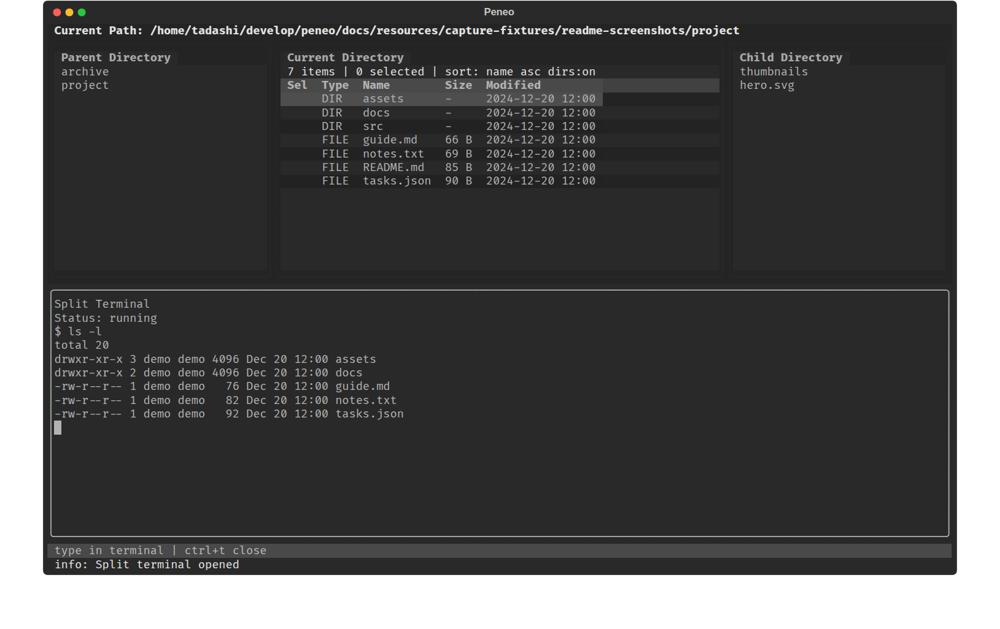

# Peneo


[English README](README.md)

Peneo は、操作を覚えなくてもすぐに使える TUI ファイルマネージャです。よく使う操作は画面下部のヘルプバーに常に表示され、その他の操作もコマンドパレットから直感的に呼び出せます。

- **覚えなくてOK**: よく使う操作はヘルプバーに常に表示
- **迷っても安心**: コマンドパレットからすべての操作を呼び出し可能
- **見やすい 3 ペイン**: 親・現在・右ペインを並べ、テキストファイルはその場でプレビュー
- **埋め込みターミナル**: `t` でシェル操作とシームレスに行き来
- **強力な検索**: 再帰ファイル検索と grep 検索で目的のファイルに即座にジャンプ
- **ターミナルエディタ連携**: カレントディレクトリで既定のターミナルエディタを起動可能
- **外部アプリで開く**: ファイルを既定のアプリケーションでそのままオープン可能


## 特徴

- 親 / 現在 / 右ペインを並べたシンプルな 3 ペイン表示です。カーソルがディレクトリ上にあるときは右ペインに子要素一覧を表示し、一般的なテキストファイル上にあるときは右ペインに構文色分け付きのテキストプレビューを表示します。ディレクトリ移動、複数選択、コピー、カット、貼り付け、ゴミ箱への移動、ファイル削除、パスのコピー、リネーム、新規作成、アーカイブの展開、zip 圧縮、ファイル検索、grep 検索、1 行シェルコマンド実行をキーボードだけで操作できます。よく使う操作は画面下部のヘルプバーに常時表示しています。

  


- 使用頻度の低い操作はコマンドパレットに集約しています。キーバインドを覚えていなくても、コマンドパレットから目的の操作を簡単に実行できます。

  

- テキストファイルの冒頭のプレビュー表示が可能です。これにより、ファイルを開かなくてもファイルの概要を確認することができます。

  

- 3 ペインの下に埋め込みターミナルを開けます。`t` でブラウザとターミナルをすばやく切り替えられます。ターミナルはカレントディレクトリで開かれるため、ディレクトリ移動の必要がなく、ブラウザでの閲覧とターミナルでの操作をシームレスに行き来できます。

  


- ファイル検索機能により、簡単に目的のファイルにジャンプすることができます。膨大なファイルの中から、名前の一部を入力するだけで目的のファイルを即座にフィルタリングし、階層を深く辿ることなく、最短ルートでファイルにアクセスできます。

  

- カレントディレクトリ配下を対象とした再帰 grep 検索が可能です。検索結果から該当ファイルへジャンプできます。また、ターミナルエディタで該当箇所を直接開くこともできます。

  

- フィルタ入力、ソート切り替えをサポートしています。次は、`.py`という文字列でフィルタして、最終更新時刻で降順でソートした例です。

  

- ブックマーク機能をサポートしており、登録したディレクトリに即座にジャンプすることができます。
  
  

- 履歴機能をサポートしており、最近アクセスしたディレクトリに即座にジャンプできます。

  

- ファイルにカーソルを合わせた状態で `e` を押すと、現在のターミナル上でターミナルエディタへ切り替えられます。`nvim`、`vim`、`nano` などのエディタでシームレスに切替可能です。次は、Peneoから`Vim`を開いた例です。

  


- ファイルやディレクトリは OS の既定アプリで開けます。例えば、カレントディレクトリを OS のファイルマネージャで開いたり、OS 側の関連付けに応じてファイルを VS Code などで開いたりできます。また、既定のターミナルを別ウィンドウで起動することもできます。


## サポートOS

| OS | サポート状況 | 備考 |
| --- | --- | --- |
| Ubuntu | サポート | 現時点で主要な動作確認対象です。 |
| Ubuntu (WSL) | サポート | WSL 上の Ubuntu を動作確認対象としています。 |
| macOS | 現時点では未サポート | 一部フォールバック実装はありますが、正式な動作確認対象ではありません。 |
| Windows | 現時点では未サポート | Windows ネイティブ実行は未サポートです。 |


## インストール

### PyPI からインストール

`uv` が入っている環境で、PyPI から直接インストールできます。

```bash
uv tool install peneo
```

### リポジトリからインストール

または、リポジトリを clone してからツールとしてインストールします。

```bash
git clone https://github.com/devgamesan/peneo.git
cd peneo
uv tool install --from . peneo
```

更新時は最新を pull したあとに同じコマンドを再実行してください。

### 依存ツール

Peneo 本体の起動は `uv` だけで行えますが、一部の機能は `PATH` 上の外部コマンドに依存します。利用する OS / 環境ごとに必要なものは次のとおりです。

#### Ubuntu / Debian

- grep 検索 (`g`) を使う場合: `ripgrep` (`rg`)
- パスコピーを使う場合:
  - X11 環境: `xclip`
  - Wayland 環境: `wl-copy`

インストール例:

```bash
sudo apt install ripgrep xclip
```

Wayland 環境の例:

```bash
sudo apt install ripgrep wl-clipboard
```

#### Ubuntu (WSL)

- grep 検索 (`g`) を使う場合: `ripgrep` (`rg`)
- パスコピーを使う場合:
  - 通常は `clip.exe` を利用できます
  - 必要に応じて Linux 側の `xclip` / `wl-copy` も利用できます
- GUI 連携を使う場合は `wslu` を推奨します
  - `wslview` などのブリッジコマンドに使います

インストール例:

```bash
sudo apt install ripgrep wslu
```

#### macOS

- grep 検索 (`g`) を使う場合: `ripgrep` (`rg`)
- パスコピーは macOS 標準の `pbcopy` を利用します

インストール例:

```bash
brew install ripgrep
```

#### Windows

- 現時点では未サポートです
- 依存ツールの案内も Windows ネイティブ実行は対象外です

## 起動

```bash
peneo
```

ファイルにカーソルを合わせた状態で `e` を押すと、現在のターミナル上でターミナルエディタへ切り替えられます。`config.toml` の `editor.command` が設定されていればそれを優先し、未設定なら `$EDITOR`、さらに `nvim`、`vim`、`nano` などの組み込み候補へフォールバックします。

## 設定ファイル

Peneo は起動時にユーザー設定用の `config.toml` を読み込みます。ファイルがまだ存在しない場合は、既定値入りの設定ファイルを自動生成します。

- Linux: `${XDG_CONFIG_HOME:-~/.config}/peneo/config.toml`
- macOS: `~/Library/Application Support/peneo/config.toml`
- Windows 向けの設定パスも予約していますが、Windows ネイティブ実行自体は引き続き非対応です

設定できる項目は次のとおりです。

| セクション | キー | 値 | 説明 |
| --- | --- | --- | --- |
| `terminal` | `linux` | shell 形式コマンド文字列の配列 | Linux 向けの任意ターミナル起動コマンドです。作業ディレクトリは `{path}` で埋め込みます。空文字や不正なエントリは無視されます。 |
| `terminal` | `macos` | shell 形式コマンド文字列の配列 | macOS 向けの任意ターミナル起動コマンドです。検証ルールは Linux と同じです。 |
| `terminal` | `windows` | shell 形式コマンド文字列の配列 | Windows / WSL ブリッジ向けの任意ターミナル起動コマンドです。Windows ネイティブ実行は未対応ですが設定キー自体は受け付けます。 |
| `editor` | `command` | shell 形式の文字列。例: `nvim -u NONE` | `e` で起動するターミナルエディタです。ファイルパスは自動で末尾に付与されるため、設定値には含めません。GUI エディタや不正なコマンドは無視されます。 |
| `display` | `show_hidden_files` | `true` / `false` | 起動時の隠しファイル表示状態です。 |
| `display` | `show_directory_sizes` | `true` / `false` | ペイン内に再帰ディレクトリサイズを表示します。大きいディレクトリでは計算コストがあるため既定値は `false` です。中央ペインを `size` ソートしている間は、この設定が `false` でも自動計算されます。 |
| `display` | `show_preview` | `true` / `false` | 右ペインのテキストファイル preview を表示します。既定値は `true` です。ディレクトリ表示や archive 表示には影響しません。 |
| `display` | `show_help_bar` | `true` / `false` | 画面下部のヘルプバーを表示します。既定値は `true` です。コマンドパレットや分割ターミナルが開いている場合は、この設定に関係なく常に表示されます。 |
| `display` | `theme` | `textual-dark` / `textual-light` | 起動時の UI テーマです。設定エディタから保存した場合もこの値が使われます。 |
| `display` | `default_sort_field` | `name` / `modified` / `size` | 中央ペインの初期ソート項目です。 |
| `display` | `default_sort_descending` | `true` / `false` | `true` のとき、起動時のソートを降順にします。 |
| `display` | `directories_first` | `true` / `false` | 中央ペインでディレクトリをファイルより先にまとめて表示します。 |
| `behavior` | `confirm_delete` | `true` / `false` | ゴミ箱削除の前に確認ダイアログを表示します。`Shift+Delete` による完全削除は常に確認します。 |
| `behavior` | `paste_conflict_action` | `prompt` / `overwrite` / `skip` / `rename` | 貼り付け競合時の既定動作です。`prompt` の場合は競合ダイアログを維持します。 |
| `logging` | `enabled` | `true` / `false` | 起動失敗や未処理例外をログファイルへ出力するかどうかを切り替えます。 |
| `logging` | `level` | `DEBUG` / `INFO` / `WARNING` / `ERROR` / `CRITICAL` | ログファイルへ出力するログレベルです。既定値は `ERROR` です。設定の反映にはアプリの再起動が必要です。 |
| `logging` | `path` | パス文字列 | 任意のログファイル保存先です。空文字なら `config.toml` と同じディレクトリの `peneo.log` を使います。ログファイルの既定の場所: Linux: `~/.config/peneo/peneo.log`、macOS: `~/Library/Application Support/peneo/peneo.log`。 |
| `bookmarks` | `paths` | 絶対パス文字列の配列 | `b` やコマンドパレットの `Show bookmarks` で使うブックマーク一覧です。重複パスは読み込み時に取り除かれます。 |

例:

```toml
[terminal]
linux = ["konsole --working-directory {path}", "gnome-terminal --working-directory={path}"]
macos = ["open -a Terminal {path}"]
windows = ["wt -d {path}"]

[editor]
command = "nvim -u NONE"

[display]
show_hidden_files = false
show_directory_sizes = false
show_preview = true
show_help_bar = true
theme = "textual-dark"
default_sort_field = "name"
default_sort_descending = false
directories_first = true

[behavior]
confirm_delete = true
paste_conflict_action = "prompt"

[logging]
enabled = true
level = "ERROR"
path = ""

[bookmarks]
paths = ["/home/user/src", "/home/user/docs"]
```

設定値が不正でも起動は止めず、該当項目だけ既定値へフォールバックして初回ロード後に警告を表示します。
`logging.enabled = true` の場合、起動失敗や未処理例外は後から調査できるように指定ログファイルへ追記されます。

## 基本操作

主要キーは次のとおりです。

| 状態 | キー | 動作 |
| --- | --- | --- |
| 通常時 | `↑` / `k` | カーソル移動 |
| 通常時 | `↓` / `j` | カーソル移動 |
| 通常時 | `PageUp` / `PageDown` | 1ページ分カーソル移動 |
| 通常時 | `Home` / `End` | 先頭/末尾のエントリへ移動 |
| 通常時 | `Shift+↑` / `Shift+↓` | 連続した範囲選択を拡張 / 縮小する |
| 通常時 | `←` / `h` / `Backspace` | 親ディレクトリへ移動 |
| 通常時 | `→` / `l` | ディレクトリなら入る |
| 通常時 | `[` | 履歴を一つ戻る |
| 通常時 | `]` | 履歴を一つ進む |
| 通常時 | `G` | 特定のパスへ移動するための入力を開き、ディレクトリ補完を使えるようにする |
| 通常時 | `~` | ホームディレクトリへ移動 |
| 通常時 | `H` | ディレクトリ履歴リストを開き、選択したディレクトリへ移動 |
| 通常時 | `b` | ブックマークリストを開き、選択したディレクトリへ移動 |
| 通常時 | `Enter` | ディレクトリなら入る、ファイルなら既定アプリで開く |
| 通常時 | `e` | カーソル中のファイルを `editor.command` -> `$EDITOR` -> 組み込み既定値の順でターミナルエディタで開く |
| 通常時 | `i` | 単一対象の属性ダイアログを開く |
| 通常時 | `R` | 現在ディレクトリを再読み込み |
| 通常時 | `Space` | 選択トグル後に次行へ移動 |
| 通常時 | `a` | 現在ディレクトリで表示中の項目をすべて選択 |
| 通常時 | `c` | 選択中の項目、またはカーソル項目をコピー対象にする |
| 通常時 | `x` | 選択中の項目、またはカーソル項目をカット対象にする |
| 通常時 | `p` | 現在ディレクトリへ貼り付け |
| 通常時 | `C` | 選択中のパス一覧、またはカーソル中のパスをシステムクリップボードへコピー |
| 通常時 | `Delete` | 選択中の項目、またはカーソル項目をゴミ箱へ移動（既定では確認あり、設定で変更可能） |
| 通常時 | `Shift+Delete` | 選択中の項目、またはカーソル項目を確認ダイアログ付きで完全削除 |
| 通常時 | `r` | 単一対象のリネーム入力を開始 |
| 通常時 | `!` | 現在ディレクトリ向けの 1 行シェルコマンド入力ダイアログを開く |
| 通常時 | `B` | 現在ディレクトリのブックマーク追加/削除を切り替える |
| 通常時 | `.` | 隠しファイル表示を切り替える |
| 通常時 | `/` | フィルタ入力を開始 |
| 通常時 | `s` | ソート順を循環切り替え |
| 通常時 | `d` | ディレクトリ優先表示を切り替え |
| 通常時 | `q` | アプリを終了 |
| 通常時 | `Esc` | フィルタ有効時はフィルタ解除、そうでなければ選択解除 |
| 通常時 | `:` | コマンドパレットを開く |
| 通常時 | `f` | 再帰ファイル検索を開く |
| 通常時 | `g` | 再帰 grep 検索を開く（`ripgrep` / `rg` が `PATH` 上に必要） |
| 通常時 | `t` | 埋め込み split terminal を開閉する |
| 通常時 | `n` | 現在ディレクトリで新規ファイル作成を開始 |
| 通常時 | `N` | 現在ディレクトリで新規ディレクトリ作成を開始 |
| 通常時（split terminal 表示中） | 文字入力やブラウザ操作キー | split terminal が入力を持つ間は無効 |
| フィルタ入力中 | 文字入力 | フィルタ文字列を更新 |
| フィルタ入力中 | `Backspace` | 1 文字削除 |
| フィルタ入力中 | `Enter` / `↓` | フィルタを適用して一覧操作へ戻る |
| フィルタ入力中 | `Esc` | フィルタを解除する |
| コマンドパレット表示中 | 文字入力 / `↑` / `↓` / `k` / `j` / `Enter` / `Esc` | コマンドを絞り込み、選択、実行、キャンセル |
| split terminal フォーカス中 | 文字入力 / 矢印 / `Enter` / `Backspace` / `Tab` | 入力を埋め込みシェルへ送る |
| split terminal フォーカス中 | `Esc` | 埋め込み split terminal を閉じる |
| split terminal フォーカス中 | `t` | 埋め込み split terminal を閉じる |
| split terminal フォーカス中 | `Ctrl+V` | クリップボードの内容をターミナルに貼り付け |
| 名前入力中 | 文字入力 / `Backspace` / `Enter` / `Esc` | リネームや新規作成の入力値を編集、確定、キャンセル |
| 確認ダイアログ表示中 | `Enter` / `Esc` | ゴミ箱削除 / 完全削除の確認を確定 / 中止 |
| 確認ダイアログ表示中 | `o` / `s` / `r` / `Esc` | 貼り付け競合を overwrite / skip / rename / cancel |

`e` は GUI アプリを別ウィンドウで開くのではなく、現在のターミナルセッション内でターミナルエディタへ切り替える操作です。`editor.command` と `$EDITOR` の両方が設定されている場合は `editor.command` を優先します。

### 検索結果モード（ファイル検索 / grep検索）

| キー | 動作 |
| --- | --- |
| `↑` / `↓` | 結果一覧のカーソル移動 |
| `Ctrl+N` / `Ctrl+P` | 結果一覧のカーソル移動（下/上） |
| `PageUp` / `PageDown` | 1ページ分カーソル移動 |
| `Home` / `End` | 先頭/末尾の結果へ移動 |
| `Enter` | 選択中の結果を開く |
| `Ctrl+E` | 選択中の結果をエディタで開く |
| `Esc` | 検索を閉じる |

**注**: 検索結果モードでは矢印キーでナビゲートします。`j`/`k` キーは検索クエリの入力に使用されます。

## コマンドパレット

使用頻度の低い操作は `:` で開くコマンドパレットにまとめています。現在使える主なコマンドは次のとおりです。

| コマンド | 表示条件 | 動作 / 補足 |
| --- | --- | --- |
| `Find files` | 常に表示 | 再帰ファイル検索を開きます。 |
| `Grep search` | 常に表示 | 再帰 grep 検索を開きます（`ripgrep` / `rg` が `PATH` 上に必要）。 |
| `History search` | 常に表示 | ディレクトリ履歴リストを開き、選択したディレクトリへ移動します。 |
| `Show bookmarks` | 常に表示 | 保存済みのブックマークリストを開き、選択したディレクトリへ移動します。 |
| `Go back` | ディレクトリ履歴に戻り先があるとき | 履歴を一つ戻ります。 |
| `Go forward` | ディレクトリ履歴に進み先があるとき | 履歴を一つ進みます。 |
| `Go to path` | 常に表示 | 特定のパスへ移動するための入力を開き、一致するディレクトリ候補表示と `Tab` 補完を使えます。 |
| `Go to home directory` | 常に表示 | ホームディレクトリへ移動します。 |
| `Reload directory` | 常に表示 | 現在ディレクトリを再読み込みします。 |
| `Toggle split terminal` | 常に表示 | 埋め込み split terminal を開閉します。 |
| `Select all` | 現在ディレクトリに表示中の項目が 1 件以上あるとき | 現在ディレクトリで表示中の項目をすべて選択します。 |
| `Show attributes` | 単一対象が選択中またはフォーカス中のとき | 読み取り専用の属性ダイアログを開きます。`i` でも実行できます。 |
| `Rename` | 単一対象が選択中またはフォーカス中のとき | 単一対象のリネーム入力を開始します。 |
| `Compress as zip` | 対象が 1 件以上あるとき | 選択中の項目、または未選択時はフォーカス中の項目を zip 圧縮します。 |
| `Extract archive` | 単一の対応アーカイブファイルが選択中またはフォーカス中のとき | `.zip` / `.tar` / `.tar.gz` / `.tar.bz2` の展開を開始します。展開先入力は絶対パスと相対パスの両方に対応し、相対パスはアーカイブ親ディレクトリ基準で解決されます。初期値はアーカイブと同じ階層にある同名ディレクトリの絶対パスです。既存パスとの衝突がある場合は事前確認し、展開中は status bar に entry 件数ベースの進捗を表示します。 |
| `Open in editor` | 単一ファイルが選択中またはフォーカス中のとき | フォーカス中のファイルを `editor.command` -> `$EDITOR` -> 組み込み既定値の順でターミナルエディタで開きます。 |
| `Copy path` | 対象が 1 件以上あるとき | 選択中のパス一覧、または未選択時はフォーカス中のパスをシステムクリップボードへコピーします。`c` でも実行できます。 |
| `Move to trash` | 対象が 1 件以上あるとき | 選択中の項目、またはフォーカス項目をゴミ箱へ移動します（既定では確認あり、設定で変更可能）。 |
| `Empty trash` | 常に表示（Linux/macOSのみ） | ゴミ箱内のすべての項目を完全に削除します。実行前に確認ダイアログを表示します。Windows では利用できません。 |
| `Open in file manager` | 常に表示 | 現在ディレクトリを OS のファイルマネージャで開きます。`m` でも実行できます。 |
| `Open terminal` | 常に表示 | `config.toml` の設定を優先しつつ、現在ディレクトリ起点で外部ターミナルを起動します。`T` でも実行できます。 |
| `Run shell command` | 常に表示 | 1 行シェルコマンド入力ダイアログを開き、現在ディレクトリでバックグラウンド実行します。完了後は先頭の出力行、または失敗要約を status bar に表示します。`!` でも実行できます。 |
| `Bookmark this directory` / `Remove bookmark` | 常に表示 | 現在ディレクトリを `[bookmarks].paths` に追加または削除します。ラベルは現在状態を反映し、`b` でも切り替えられます。 |
| `Show hidden files` / `Hide hidden files` | 常に表示 | ブラウザ 3 ペインの隠しファイル表示を切り替えます。ラベルは現在状態を反映し、`.` でも切り替えられます。 |
| `Edit config` | 常に表示 | 起動時設定を編集するオーバーレイを開きます。優先ターミナルエディタ、隠しファイル表示、ディレクトリサイズ表示、テキスト preview 表示、テーマ、ソート、貼り付け競合時の既定動作、削除確認の有無などを編集できます。`↑` / `↓` で項目移動、`←` / `→` / `Enter` で値変更、`s` で `config.toml` 保存、`e` で生の設定ファイルをターミナルエディタで開けます。 |
| `Create file` | 常に表示 | 現在ディレクトリで新規ファイル作成の入力を開始します。 |
| `Create directory` | 常に表示 | 現在ディレクトリで新規ディレクトリ作成の入力を開始します。 |

## 注意事項

- サポート状況は上記の「サポートOS」セクションを参照してください。
- 既定アプリ起動、ファイルマネージャ起動、ターミナル起動などの GUI 連携は、主に Ubuntu と WSL 上の Ubuntu で確認しています。
- 埋め込み split terminal は現状 POSIX 環境、特に Ubuntu/Linux と WSL を前提にしています。
- `config.toml` でターミナルエディタやターミナル起動コマンドを指定した場合は、その設定を組み込みフォールバックより優先します。
- WSL では、優先ブリッジ動作に使う `wslview` を利用できるよう `wslu` のインストールを推奨します。
- WSL では `wslview`、`explorer.exe`、`clip.exe` のような Windows 側ブリッジを優先し、WSLg や Linux デスクトップ向けのフォールバックも維持します。
- 挙動やキーバインドは今後見直す可能性があります。
- ファイル操作は、選択したディレクトリエントリ自体に対して行われます。選択中の項目が symlink の場合も、リンク先を暗黙に辿って変更せず、symlink エントリ自体を操作します。

## 関連ドキュメント

- 実装構造: [docs/architecture.md](docs/architecture.md)
- 性能確認メモ: [docs/performance.md](docs/performance.md)

## 開発者向け

開発環境を作る場合は次を実行します。

```bash
uv sync --python 3.12 --dev
```

ローカル checkout から直接アプリを起動する場合は、リポジトリ直下で次を使えます。

```bash
uv run peneo
```

テストと静的検査:

```bash
uv run ruff check .
uv run pytest
```

### TestPyPI からインストール

リリース前のバージョンをテストする場合は、TestPyPI からインストールできます:

```bash
uv tool install \
  --index-url https://test.pypi.org/simple/ \
  --extra-index-url https://pypi.org/simple/ \
  --index-strategy unsafe-best-match \
  peneo
```
