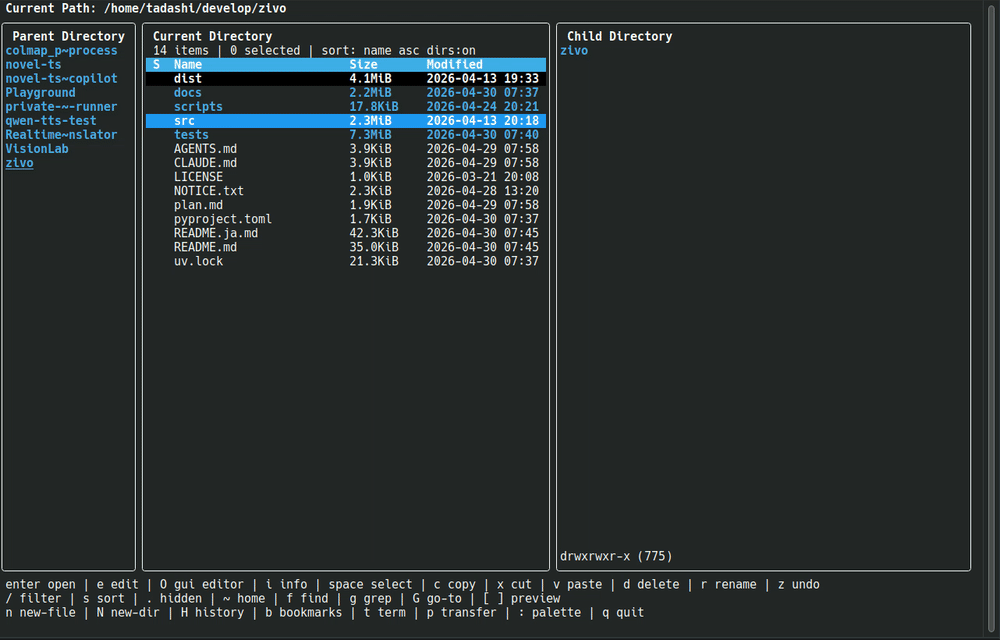
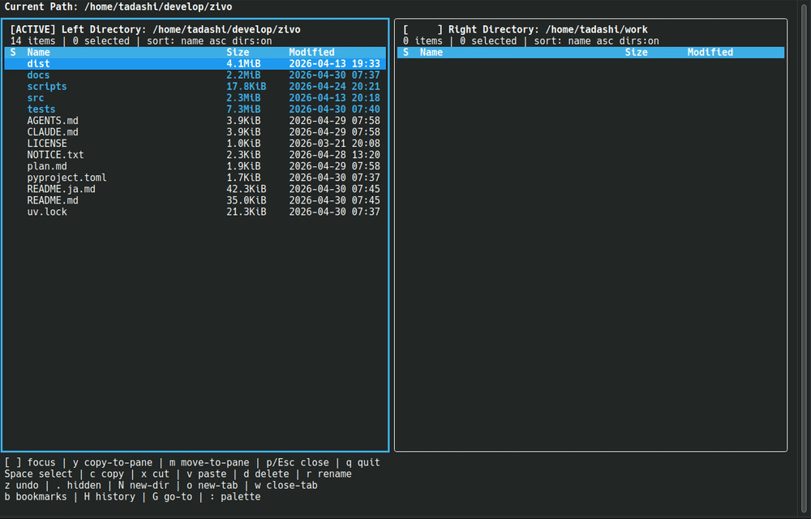

# zivo


---
[English](README.md) | [日本語](README.ja.md)
---

zivo は、キーバインドをたくさん覚えなくても使える TUI ファイルマネージャです。

よく使う操作はヘルプバーに常に表示し、その他の操作はコマンドパレットから検索して実行できます。ファイルの閲覧、プレビュー、検索、grep、置換、2 ディレクトリ間の転送をターミナル内で完結できます。

---

## zivo が向いている人

- TUI ファイルマネージャを使いたいが、キーバインド暗記が面倒な人
- ターミナル内でファイル閲覧・検索・移動・置換まで済ませたい人
- ranger / lf / nnn / yazi は便利だが少し玄人向けだと感じる人
- WSL やターミナル中心の環境で、GUI ファイラーに切り替えず作業したい人

---

## 主な特徴

- **覚えなくてOK**: よく使う操作はヘルプバーに常に表示
- **迷っても安心**: `:` のコマンドパレットからすべての操作を検索して実行
- **3 ペインプレビュー**: ディレクトリ、テキスト、画像、PDF、Office ファイルを右ペインで確認
- **Transfer モード**: 2 つのディレクトリを並べてコピー・移動
- **検索と grep**: ファイル検索、grep 検索、結果からのジャンプ
- **安全な置換**: diff preview を確認してから一括置換
- **補助的なマウス操作**: 行やペインのクリック、連続クリックで開く操作、プレビューのホイールスクロール

---



プレビューを見ながらファイルを移動し、`:` のコマンドパレットから必要な操作を検索して実行できます。
キーバインドを覚えていなくても、ヘルプバーとコマンドパレットで迷わず操作できます。



Transfer モードでは、2つのディレクトリを左右に並べて、選択したファイルを反対側のペインへコピーまたは移動できます。
`y` でコピー、`m` で移動でき、転送結果をその場で確認できます。

---

## インストール

### 最小構成

```bash
uv tool install zivo
```

### 推奨ツール

一部の機能は外部コマンドを利用します。

| 機能 | 使用するツール |
| --- | --- |
| 画像プレビュー | `chafa` |
| PDF プレビュー | `pdftotext` / `poppler` |
| Office プレビュー | `pandoc` |
| grep 検索 | `ripgrep` |

OS 別の詳しいセットアップは [Platforms](docs/platforms.ja.md) を参照してください。

---

## 起動

```bash
zivo
```

`zivo` 単体では親シェルのカレントディレクトリを変更できません。終了時に最後に見ていたディレクトリへ親シェルも追従させたい場合は、先に shell integration を読み込みます。

```bash
eval "$(zivo init bash)"  # bash 用
eval "$(zivo init zsh)"   # zsh 用
```

これにより `zivo-cd` というシェル関数が定義されます。終了後に親シェルを最後のディレクトリへ `cd` させたいときは、`zivo` ではなく `zivo-cd` で起動します。

```bash
zivo-cd
```

**注**: シェル統合 (`zivo-cd`) は現在 Windows ではサポートされていません。Windows では通常の `zivo` を使用してください。

---

## 基本操作

よく使う操作は画面下部のヘルプバーに常に表示されます。
すべての操作は `:` のコマンドパレットから検索して実行できます。

| キー | 操作 |
|---|---|
| `↑` / `↓` or `j` / `k` | 移動 |
| `Enter` | 開く / ディレクトリに入る |
| `Backspace` / `←` | 親ディレクトリへ戻る |
| `Space` | 選択 |
| `:` | コマンドパレット |
| `/` | フィルタ |
| `f` | ファイル検索 |
| `g` | grep 検索 |
| `p` | Transfer モード切替 |
| `q` | 終了 |

詳しいキーバインドは [Keybindings](docs/keybindings.ja.md) を参照してください。

---

## コマンドパレット

`:` を押すと、利用可能な操作を検索して実行できます。
キーバインドを覚えていない操作や、使用頻度の低い操作はここから呼び出せます。

詳しいコマンド一覧は [Commands](docs/commands.ja.md) を参照してください。

---

## 設定

zivo は初回起動時に `config.toml` を自動生成します。
テーマ、プレビュー、ソート、エディタ連携、削除確認などを設定できます。
また、外部ツールを起動するカスタムアクションをコマンドパレットに追加できます。

詳しくは [Configuration](docs/configuration.ja.md) を参照してください。
カスタムアクションの設定例と安全上の注意は [Custom Actions](docs/custom-actions.ja.md) を参照してください。

---

## 安全性について

zivo はファイル操作の事故を防ぐための安全機構を備えています。

- **ゴミ箱移動**: `d` / `Delete` で OS 標準のゴミ箱へ移動（確認ダイアログ表示可能）
- **完全削除**: `D` / `Shift+Delete` は常に確認後に実行
- **Undo**: `z` で直前のリネーム・貼り付け・ゴミ箱移動を取り消し
- **貼り付け競合解決**: 上書き / スキップ / リネームを選択可能
- **置換プレビュー**: diff preview で確認してから一括置換を実行
- **その他の詳細**: [Safety](docs/safety.ja.md) を参照

---

## 関連ドキュメント

- [Keybindings](docs/keybindings.ja.md) — 全キーバインド一覧
- [Commands](docs/commands.ja.md) — コマンドパレット全コマンド一覧
- [Custom Actions](docs/custom-actions.ja.md) — カスタムアクション設定ガイド
- [Configuration](docs/configuration.ja.md) — 設定ファイルの詳細
- [Platforms](docs/platforms.ja.md) — OS 別セットアップ
- [Safety](docs/safety.ja.md) — 安全仕様
- [Architecture](docs/architecture.md) — 実装構造
- [Performance](docs/performance.md) — 性能確認メモ
- [Release Checklist](docs/release-checklist.md) — リリースチェックリスト

---

## ライセンス

zivo は MIT ライセンスで提供されています。詳細は [LICENSE](LICENSE) を確認してください。

### サードパーティーライセンス

zivo はサードパーティーパッケージに依存しています。依存パッケージとそのライセンスの一覧は [NOTICE.txt](NOTICE.txt) を確認してください。

依存関係を更新した後に NOTICE.txt を更新するには:

```bash
uv run pip-licenses --format=plain --from=mixed --with-urls --output-file NOTICE.txt
```

---

## 開発者向け

開発環境を作る場合は次を実行します。

```bash
uv sync --python 3.12 --dev
```

ローカル checkout から直接アプリを起動する場合は、リポジトリ直下で次を使えます。

```bash
uv run zivo
```

テストと静的検査:

```bash
uv run ruff check .
uv run pytest
```

### TestPyPI からインストール

リリース前のバージョンをテストする場合は、TestPyPI からインストールできます:

```bash
uv tool install \
  --index-url https://test.pypi.org/simple/ \
  --extra-index-url https://pypi.org/simple/ \
  --index-strategy unsafe-best-match \
  zivo
```
