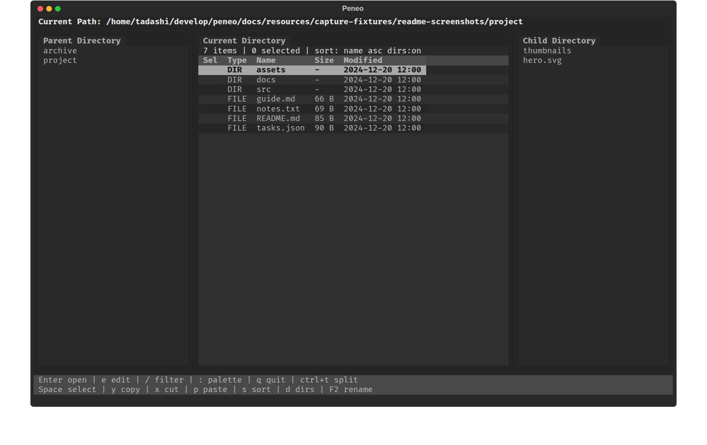

# Plain

Plain は、GUI のエクスプローラーに近い感覚で使えることを目指している、Textual ベースの TUI ファイルマネージャです。  
Vim 風の操作を前提にせず、ヘルプを読み込まなくても主要操作にたどり着ける構成を目指しています。



_現在の 3 ペイン UI。親ディレクトリ、現在のディレクトリ、子ディレクトリを並べて表示します。_

## 特徴

- 親 / 現在 / 子ディレクトリを並べた 3 ペイン表示
- ディレクトリ移動、選択、コピー、カット、貼り付け、削除、リネーム、新規作成をキーボードだけで操作
- フィルタ入力、ソート切り替え、隠しファイル表示切り替えをサポート
- 使用頻度の低い操作はコマンドパレットにまとめ、普段使うキーを増やしすぎない構成
- ファイルは OS の既定アプリで開き、必要なら `e` で現在のターミナル内エディタを起動し、ターミナルも現在ディレクトリで起動可能

## 現在できること

- ディレクトリの閲覧と移動
- ファイル / ディレクトリの複数選択
- copy / cut / paste
- ゴミ箱への削除
- 単一対象のリネーム
- 新規ファイル / 新規ディレクトリ作成
- ファイル名フィルタ
- 名前 / 更新日時 / サイズでのソート切り替え
- ディレクトリ優先表示の ON / OFF
- パスのクリップボードコピー
- 現在ディレクトリでのターミナル起動
- 隠しファイル表示切り替え
- ファイルの既定アプリ起動
- ファイルの現在のターミナル内エディタ起動

## インストール

`uv` が入っている環境で、リポジトリを clone してからツールとしてインストールします。

```bash
git clone https://github.com/devgamesan/plain.git
cd plain
uv tool install --from . plain
```

更新時は最新を pull したあとに同じコマンドを再実行してください。

## 起動

```bash
plain
```

開発中にローカル checkout から直接起動したい場合は、リポジトリ直下で次を使えます。

```bash
uv run plain
```

## 基本操作

主要キーは次のとおりです。

| 状態 | キー | 動作 |
| --- | --- | --- |
| 通常時 | `↑` / `↓` | カーソル移動 |
| 通常時 | `←` / `Backspace` / `Ctrl+H` | 親ディレクトリへ移動 |
| 通常時 | `→` | ディレクトリなら入る |
| 通常時 | `Enter` | ディレクトリなら入る、ファイルなら既定アプリで開く |
| 通常時 | `e` | カーソル中のファイルを現在のターミナル内エディタで開く |
| 通常時 | `F5` | 現在ディレクトリを再読み込み |
| 通常時 | `Space` | 選択トグル後に次行へ移動 |
| 通常時 | `y` | 選択中の項目、またはカーソル項目をコピー対象にする |
| 通常時 | `x` | 選択中の項目、またはカーソル項目をカット対象にする |
| 通常時 | `p` | 現在ディレクトリへ貼り付け |
| 通常時 | `Delete` | 選択中の項目、またはカーソル項目をゴミ箱へ移動 |
| 通常時 | `F2` | 単一対象のリネーム入力を開始 |
| 通常時 | `/` | フィルタ入力を開始 |
| 通常時 | `s` | ソート順を循環切り替え |
| 通常時 | `d` | ディレクトリ優先表示を切り替え |
| 通常時 | `Esc` | フィルタ有効時はフィルタ解除、そうでなければ選択解除 |
| 通常時 | `:` | コマンドパレットを開く |
| フィルタ入力中 | 文字入力 | フィルタ文字列を更新 |
| フィルタ入力中 | `Backspace` | 1 文字削除 |
| フィルタ入力中 | `Enter` / `↓` | フィルタを適用して一覧操作へ戻る |
| フィルタ入力中 | `Esc` | フィルタを解除する |
| コマンドパレット表示中 | 文字入力 / `↑` / `↓` / `Enter` / `Esc` | コマンドを絞り込み、選択、実行、キャンセル |
| 名前入力中 | 文字入力 / `Backspace` / `Enter` / `Esc` | リネームや新規作成の入力値を編集、確定、キャンセル |
| 確認ダイアログ表示中 | `Enter` / `Esc` | 削除確認を確定 / 中止 |
| 確認ダイアログ表示中 | `o` / `s` / `r` / `Esc` | 貼り付け競合を overwrite / skip / rename / cancel |

## コマンドパレット

使用頻度の低い操作は `:` で開くコマンドパレットにまとめています。現在使える主なコマンドは次のとおりです。

- `Create file`
- `Create directory`
- `Copy path`
- `Open terminal here`
- `Show hidden files` / `Hide hidden files`

実装途中のコマンドは候補に表示されても dim 表示になり、実行できません。

## 対応環境と注意

- 現時点で動作確認している OS は Ubuntu のみです。
- コード上は Linux / macOS / Windows 向けの外部起動処理を持っていますが、動作確認済みとは限りません。
- まだ開発途中です。挙動やキーバインドは今後見直す可能性があります。
- 英語版 README はまだ用意していません。

## 関連ドキュメント

- 実装構造: [docs/architecture.md](docs/architecture.md)
- MVP メモ: [docs/spec_mvp.md](docs/spec_mvp.md)
- 性能確認メモ: [docs/performance.md](docs/performance.md)

## 開発者向け

開発環境を作る場合は次を実行します。

```bash
uv sync --python 3.12 --dev
```

テストと静的検査:

```bash
uv run ruff check .
uv run pytest
```
