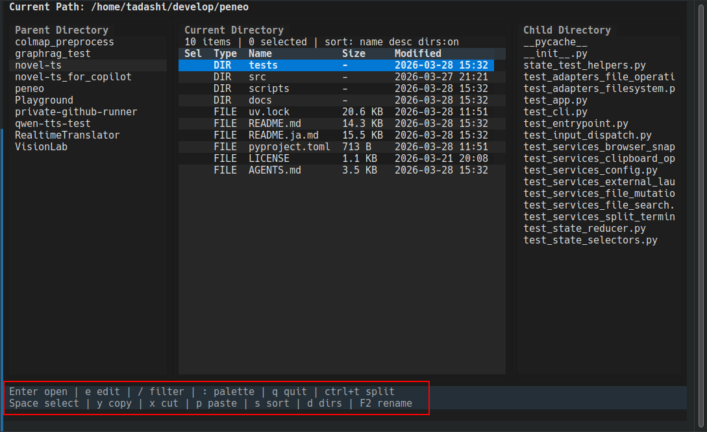
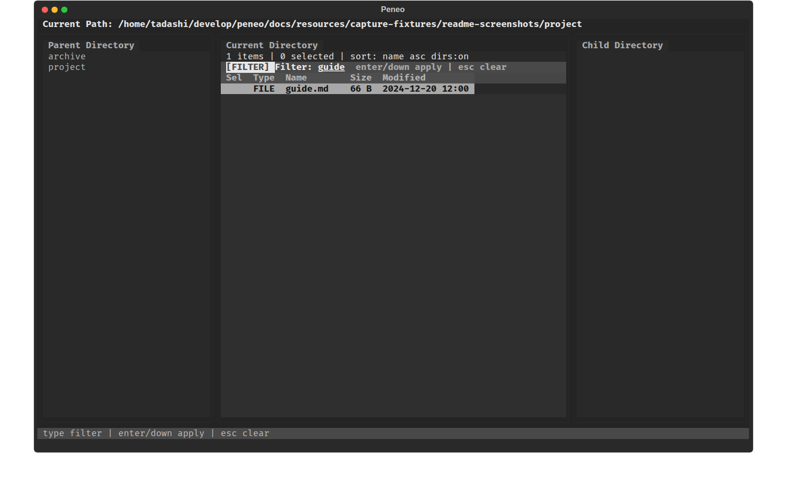
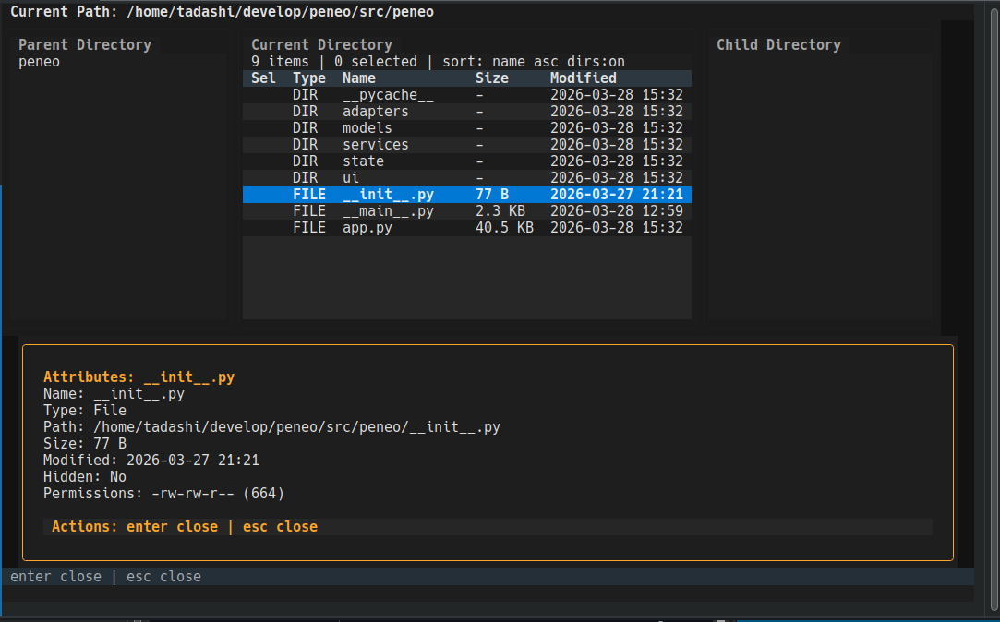
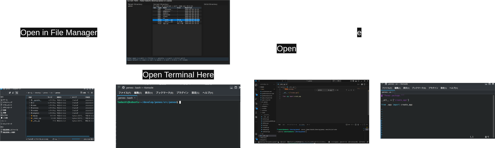

# Peneo

[日本語版 README](README.ja.md)

Peneo is a Textual-based TUI file manager for environments where you want to keep working in the terminal while still moving smoothly into GUI applications. Its three-pane layout shows the parent, current, and child directories side by side, aiming to feel closer to a GUI file explorer than to a keyboard-heavy power-user tool. Common actions stay visible in the on-screen help, and files can be opened in the OS default app directly from Peneo.

## Features

- Simple three-pane layout for parent / current / child directories. You can navigate directories, multi-select items, copy, cut, paste, move to trash, rename, create files or directories, compress targets into zip archives, and extract supported archives entirely from the keyboard.
  
  _Operating the current directory while keeping surrounding hierarchy visible in the three-pane layout._
- Common actions stay visible in the on-screen help so the interface is easy to pick up without memorizing a large keymap.
  
  _The help bar at the bottom keeps the main keys visible at all times._
- Less frequent actions are grouped in the command palette.
  
  _The command palette opened with `:`, showing the main commands._
- An embedded split terminal can be opened below the browser panes. `Ctrl+T` switches quickly between the browser and terminal.
  
  _The embedded split terminal opened with `Ctrl+T`, keeping the browser panes visible while shell output stays in view._
- Filter input, recursive file search, recursive grep search, directory-size display, and sort switching are supported.
  
  _Inline filter input opened with `/`, narrowing the current directory contents in place._
  
  _`Find file` opened with `Ctrl+F`, searching recursively under the current directory._
- File and directory attributes can also be inspected.
  
  _The attribute dialog showing details such as path, size, modified time, and permissions._
- Files can be opened with the OS default app. The current directory can also be handed off to the OS file manager or an external terminal, and `e` can launch a terminal editor in the current terminal session when needed.
  
  _Operations for opening files with the default app or handing off the current directory to external applications._

## Installation

With `uv` installed, clone the repository and install Peneo as a tool.

```bash
git clone https://github.com/devgamesan/peneo.git
cd peneo
uv tool install --from . peneo
```

### Dependencies

Some features depend on external commands being available on `PATH`:

**Required for grep search (`Ctrl+G`):**
- `ripgrep` (`rg`)

**Required for copy path command:**
- Linux: `xclip` or `wl-copy` (Wayland)
- macOS: `pbcopy` (included with macOS)
- WSL: `clip.exe` (included with WSL), or Linux commands above

**Recommended for WSL:**
- `wslu` for bridge commands (`wslview`, etc.)

Install dependencies on Ubuntu / Debian:

```bash
# For grep search and copy path
sudo apt install ripgrep xclip

# For WSL (optional but recommended)
sudo apt install wslu
```

To update, pull the latest changes and run the same install command again.

## Run

```bash
peneo
```

To launch directly from a local checkout during development, run this from the repository root:

```bash
uv run peneo
```

`peneo` itself cannot change the current directory of the parent shell. If you want your shell to `cd` into the last directory you visited after quitting Peneo, add the following line to your shell startup file first, such as `.bashrc` or `.zshrc`:

```bash
eval "$(peneo init bash)"  # for bash
eval "$(peneo init zsh)"   # for zsh
```

Open a new shell, or run the same line once in your current shell to enable it immediately. This defines a shell function named `peneo-cd`. After that, launch `peneo-cd` instead of `peneo` when you want the shell directory to follow Peneo on exit:

```bash
peneo-cd
```

Use plain `peneo` or `uv run peneo` when you do not need that behavior.

When a file is focused, press `e` to switch into a terminal editor in the current terminal session. Peneo prefers `config.toml` `editor.command` when set, then falls back to `$EDITOR`, then built-in defaults such as `nvim`, `vim`, or `nano`.

## Configuration File

On startup, Peneo reads `config.toml` from the platform-specific user config directory.
If the file does not exist yet, Peneo creates it automatically with default values.

- Linux: `${XDG_CONFIG_HOME:-~/.config}/peneo/config.toml`
- macOS: `~/Library/Application Support/peneo/config.toml`
- Windows config path is reserved for future compatibility, but native Windows runtime is still unsupported

The supported settings are:

| Section | Key | Values | Description |
| --- | --- | --- | --- |
| `terminal` | `linux` | Array of shell-style command templates | Optional terminal launch commands for Linux. Use `{path}` as the working-directory placeholder. Invalid or empty entries are ignored. |
| `terminal` | `macos` | Array of shell-style command templates | Optional terminal launch commands for macOS, validated the same way as Linux entries. |
| `terminal` | `windows` | Array of shell-style command templates | Optional terminal launch commands for Windows and WSL bridge workflows. The config key is accepted even though native Windows runtime is not currently supported. |
| `editor` | `command` | Shell-style string, for example `nvim -u NONE` | Optional terminal editor command used by `e`. Do not include the file path; Peneo appends it automatically. Unsupported GUI editors or invalid commands are ignored. |
| `display` | `show_hidden_files` | `true` / `false` | Default hidden-file visibility when the app starts. |
| `display` | `show_directory_sizes` | `true` / `false` | Shows recursive directory sizes in the panes. Defaults to `false` because large directories can be expensive to scan. Peneo also calculates sizes automatically while the main pane is sorted by `size`. |
| `display` | `theme` | `textual-dark` / `textual-light` | Default UI theme applied on startup and after saving from the settings editor. |
| `display` | `default_sort_field` | `name` / `modified` / `size` | Default sort field for the main pane. |
| `display` | `default_sort_descending` | `true` / `false` | Starts the main-pane sort in descending order when enabled. |
| `display` | `directories_first` | `true` / `false` | Keeps directories grouped before files in the main pane. |
| `behavior` | `confirm_delete` | `true` / `false` | Shows a confirmation dialog before moving items to trash. |
| `behavior` | `paste_conflict_action` | `prompt` / `overwrite` / `skip` / `rename` | Chooses the default paste-conflict behavior. `prompt` keeps the conflict dialog enabled. |
| `bookmarks` | `paths` | Array of absolute path strings | Bookmarked directories shown by `Ctrl+B` and `Show bookmarks` in the command palette. Duplicate paths are removed when the config is loaded. |

Example:

```toml
[terminal]
linux = ["konsole --working-directory {path}", "gnome-terminal --working-directory={path}"]
macos = ["open -a Terminal {path}"]
windows = ["wt -d {path}"]

[editor]
command = "nvim -u NONE"

[display]
show_hidden_files = false
show_directory_sizes = false
theme = "textual-dark"
default_sort_field = "name"
default_sort_descending = false
directories_first = true

[behavior]
confirm_delete = true
paste_conflict_action = "prompt"

[bookmarks]
paths = ["/home/user/src", "/home/user/docs"]
```

Invalid config values do not stop startup. Peneo falls back to built-in defaults and shows a warning after the initial directory load.

## Basic Operations

The main keys are listed below.

| State | Key | Behavior |
| --- | --- | --- |
| Normal | `↑` / `k` | Move the cursor |
| Normal | `↓` / `j` | Move the cursor |
| Normal | `←` / `h` / `Backspace` | Move to the parent directory |
| Normal | `→` / `l` | Enter the item if it is a directory |
| Normal | `Alt+←` | Go back to the previous directory in history |
| Normal | `Alt+→` | Go forward to the next directory in history |
| Normal | `Ctrl+J` | Open go-to-path input to navigate to a specific path |
| Normal | `Alt+Home` | Go to home directory |
| Normal | `Ctrl+O` | Open the directory history list and jump to a selected directory |
| Normal | `Ctrl+B` | Open the bookmark list and jump to a selected directory |
| Normal | `Enter` | Enter a directory, or open a file with the default app |
| Normal | `e` | Open the focused file in a terminal editor, using `editor.command` -> `$EDITOR` -> built-in defaults |
| Normal | `F5` | Reload the current directory |
| Normal | `Space` | Toggle selection, then move to the next row |
| Normal | `y` | Copy the selected items, or the focused item if nothing is selected |
| Normal | `x` | Cut the selected items, or the focused item if nothing is selected |
| Normal | `p` | Paste into the current directory |
| Normal | `Delete` | Move the selected items, or the focused item, to trash (confirmation is enabled by default and can be configured) |
| Normal | `F2` | Start rename input for a single target |
| Normal | `/` | Start filter input |
| Normal | `s` | Cycle the sort order |
| Normal | `d` | Toggle directories-first ordering |
| Normal | `q` | Quit the app |
| Normal | `Esc` | Clear the active filter, otherwise clear the selection |
| Normal | `:` | Open the command palette |
| Normal | `Ctrl+F` | Open recursive file search |
| Normal | `Ctrl+G` | Open recursive grep search (`ripgrep` / `rg` required on `PATH`) |
| Normal | `Ctrl+T` | Open or close the embedded split terminal |
| Normal (with split terminal open) | Text input and browser shortcuts | Disabled while the split terminal owns input |
| Filter input | Text input | Update the filter string |
| Filter input | `Backspace` | Delete one character |
| Filter input | `Enter` / `↓` | Apply the filter and return to list navigation |
| Filter input | `Esc` | Clear the filter |
| Command palette | Text input / `↑` / `↓` / `k` / `j` / `Enter` / `Esc` | Filter, select, run, or cancel commands |
| Split terminal focus | Text input / arrows / `Enter` / `Backspace` / `Tab` | Send input directly to the embedded shell |
| Split terminal focus | `Esc` | Close the embedded split terminal |
| Split terminal focus | `Ctrl+T` | Close the embedded split terminal |
| Split terminal focus | `Ctrl+V` | Paste clipboard contents into the terminal |
| Name input | Text input / `Backspace` / `Enter` / `Esc` | Edit, confirm, or cancel rename/create input |
| Confirmation dialog | `Enter` / `Esc` | Confirm or cancel delete |
| Confirmation dialog | `o` / `s` / `r` / `Esc` | Resolve a paste conflict with overwrite / skip / rename / cancel |

`e` switches into a terminal editor in the current terminal session rather than opening a separate GUI app window. If both `editor.command` and `$EDITOR` are set, `editor.command` takes precedence.

## Command Palette

Less frequent actions are grouped in the command palette opened with `:`.

| Command | Shown when | Behavior / Notes |
| --- | --- | --- |
| `Find files` | Always | Opens recursive file search. |
| `Grep search` | Always | Opens recursive grep search (`ripgrep` / `rg` required on `PATH`). |
| `History search` | Always | Opens directory history list and jump to a selected directory. |
| `Show bookmarks` | Always | Opens the saved bookmark list and jumps to the selected directory. |
| `Go back` | Directory history has a previous entry | Moves to the previous directory in history. |
| `Go forward` | Directory history has a forward entry | Moves to the next directory in history. |
| `Go to path` | Always | Opens go-to-path input to navigate to a specific path. |
| `Go to home directory` | Always | Navigates to the home directory. |
| `Reload directory` | Always | Reloads the current directory. |
| `Toggle split terminal` | Always | Opens or closes the embedded split terminal. |
| `Rename` | Exactly one target is selected or focused | Starts rename input for a single target. |
| `Compress as zip` | At least one target is selected or focused | Starts zip compression for the selected items, or the focused item when nothing is selected. The destination input accepts absolute and relative paths resolved from the current directory, defaults to a `.zip` path next to the selected content, and asks for confirmation before overwriting an existing zip file. |
| `Extract archive` | Exactly one supported archive file is selected or focused | Starts archive extraction for `.zip`, `.tar`, `.tar.gz`, or `.tar.bz2`. The destination input accepts absolute and relative paths. Relative paths are resolved from the archive file's parent directory, and the default value is a same-name directory next to the archive. Existing destination paths are confirmed before extraction, and the status bar shows entry-count progress while the extraction runs. |
| `Open in editor` | Exactly one file is selected or focused | Opens the focused file in a terminal editor, using `editor.command` -> `$EDITOR` -> built-in defaults. |
| `Copy path` | At least one target is selected or focused | Copies the selected path list, or the focused path when nothing is selected, to the system clipboard. |
| `Move to trash` | At least one target is selected or focused | Moves the selected items, or the focused item, to trash (confirmation is enabled by default and can be configured). |
| `Open in file manager` | Always | Opens the current directory in the OS file manager. |
| `Open terminal` | Always | Launches an external terminal rooted at the current directory, using `config.toml` templates before built-in fallbacks. |
| `Bookmark this directory` / `Remove bookmark` | Always | Saves or removes the current directory in `[bookmarks].paths`. The label reflects whether the current directory is already bookmarked. |
| `Show hidden files` / `Hide hidden files` | Always | Toggles hidden-file visibility for the browser panes. The label reflects the current visibility state. |
| `Edit config` | Always | Opens the settings overlay for startup defaults. You can edit the preferred terminal editor, hidden-file visibility, directory-size visibility, theme, sorting, default paste-conflict behavior, and delete confirmation. Use `↑` / `↓` to move, `←` / `→` / `Enter` to change values, `s` to save `config.toml`, and `e` to open the raw config file in a terminal editor. |
| `Create file` | Always | Starts the inline create-file flow in the current directory. |
| `Create directory` | Always | Starts the inline create-directory flow in the current directory. |

## Platform Notes

- The project is currently verified on Ubuntu and Ubuntu running under WSL.
- GUI integration paths such as default-app launch, file-manager launch, and terminal launch are currently validated primarily in those environments.
- The embedded split terminal currently targets POSIX environments such as Ubuntu/Linux and WSL.
- External-launch behavior includes Linux, macOS, and WSL-aware fallbacks. Native Windows is not a supported runtime for Peneo.
- `config.toml` can override both the preferred terminal editor and external terminal launch commands before those built-in fallbacks are used.
- On WSL, install `wslu` to make `wslview` available for the preferred bridge behavior.
- WSL prefers Windows-side bridges such as `wslview`, `explorer.exe`, and `clip.exe` when available, with Linux-side fallbacks kept for WSLg and desktop Linux environments.
- Behavior and keybindings may change in future revisions.
- File mutations operate on the selected directory entry. If the selected item is a symlink, Peneo mutates the symlink itself instead of silently following and mutating the link target.

## Related Documents

- Implementation structure: [docs/architecture.en.md](docs/architecture.en.md)
- MVP notes: [docs/spec_mvp.en.md](docs/spec_mvp.en.md)
- Performance notes: [docs/performance.en.md](docs/performance.en.md)

## Development

To prepare the development environment:

```bash
uv sync --python 3.12 --dev
```

Lint and test:

```bash
uv run ruff check .
uv run pytest
```
