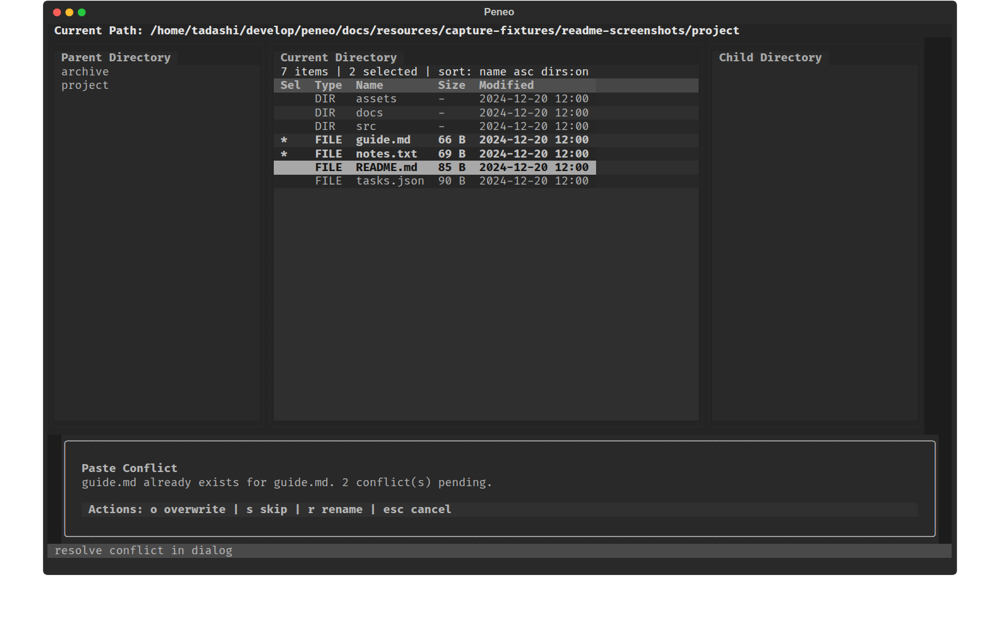

# Peneo

[日本語版 README](README.ja.md)

Peneo is a Textual-based TUI file manager designed for desktop environments where terminal work still needs to connect smoothly with GUI applications.
It aims to feel closer to a GUI explorer than to a keyboard-heavy power-user tool, and keeps common actions visible in the on-screen help so you can start using it without memorizing a Vim-style key map.


_Current three-pane UI showing the parent, current, and child directories side by side with mixed project files visible._

## Features

- Three-pane layout for parent / current / child directories so surrounding filesystem context stays visible
- Optional embedded split terminal below the browser panes, opened and closed with a single shortcut and focused immediately
- Common actions stay visible in the on-screen help, while less frequent actions live in the command palette
- Keyboard-only navigation, multi-selection, copy, cut, paste, delete-to-trash, rename, and create flows
- Filter input, recursive file search from the command palette, attribute inspection, config editing, sort switching, and hidden-file visibility toggle
- Files open with the OS default app, directories can be opened in the OS file manager, `e` opens the current file in the editor inside the current terminal, and a terminal can also be launched in the current directory
- Optional shell integration via `peneo-cd` can return your shell to the last directory after quitting
- Safer file operations with trash deletion and overwrite / skip / rename conflict resolution during paste

## Screenshots

The hero image above shows the default overview. The following screens highlight the main workflows in the app.

### Optional Embedded Split Terminal


_Split terminal opened with `Ctrl+T`, keeping the browser panes visible while shell output stays in view._

### Multi-selection And Paste Conflict



_Multiple files selected with `Space`, followed by a paste-conflict dialog for copy workflows._

### Command Palette


_The command palette opened with `:`, showing the main commands without leaving the browser context._

### Filter Input


_Inline filter input opened with `/`, narrowing the current directory contents as you type._

### Attribute Dialog


_The read-only attribute dialog showing file details such as path, size, modified time, and permissions._

## Current Capabilities

- Browse directories and move through the filesystem
- Multi-select files and directories
- copy / cut / paste
- Move items to trash
- Rename a single target
- Create files and directories
- Filter by file name
- Search files recursively from the command palette
- Inspect file and directory attributes from the command palette
- Edit startup config values from the command palette and save them back to `config.toml`
- Switch sorting by name / modified time / size
- Toggle directories-first ordering
- Copy paths to the system clipboard
- Open the current directory in the OS file manager
- Launch a terminal in the current directory
- Open an embedded split terminal rooted at the current directory
- Toggle hidden-file visibility
- Open files with the OS default app
- Open files in the editor inside the current terminal
- Persist display, behavior, and terminal-launch preferences in `config.toml`
- Optionally return the shell to the last visited directory after quitting

## Installation

With `uv` installed, clone the repository and install Peneo as a tool.

```bash
git clone https://github.com/devgamesan/peneo.git
cd peneo
uv tool install --from . peneo
```

To update, pull the latest changes and run the same install command again.

## Run

```bash
peneo
```

To launch directly from a local checkout during development, run this from the repository root:

```bash
uv run peneo
```

`peneo` itself cannot change the current directory of the parent shell. If you want your shell to `cd` into the last directory you visited after quitting Peneo, add the following line to your shell startup file first, such as `.bashrc` or `.zshrc`:

```bash
eval "$(peneo init bash)"  # for bash
eval "$(peneo init zsh)"   # for zsh
```

Open a new shell, or run the same line once in your current shell to enable it immediately. This defines a shell function named `peneo-cd`. After that, launch `peneo-cd` instead of `peneo` when you want the shell directory to follow Peneo on exit:

```bash
peneo-cd
```

Use plain `peneo` or `uv run peneo` when you do not need that behavior.

When a file is focused, press `e` to jump into a terminal editor such as `$EDITOR`, `nvim`, `vim`, or `nano` in the current terminal session.

## Configuration File

On startup, Peneo reads `config.toml` from the platform-specific user config directory.
If the file does not exist yet, Peneo creates it automatically with default values.

- Linux: `${XDG_CONFIG_HOME:-~/.config}/peneo/config.toml`
- macOS: `~/Library/Application Support/peneo/config.toml`
- Windows config path is reserved for future compatibility, but native Windows runtime is still unsupported

The supported settings are:

| Section | Key | Values | Description |
| --- | --- | --- | --- |
| `terminal` | `linux` | Array of shell-style command templates | Optional terminal launch commands for Linux. Use `{path}` as the working-directory placeholder. Invalid or empty entries are ignored. |
| `terminal` | `macos` | Array of shell-style command templates | Optional terminal launch commands for macOS, validated the same way as Linux entries. |
| `terminal` | `windows` | Array of shell-style command templates | Optional terminal launch commands for Windows and WSL bridge workflows. The config key is accepted even though native Windows runtime is not currently supported. |
| `display` | `show_hidden_files` | `true` / `false` | Default hidden-file visibility when the app starts. |
| `display` | `theme` | `textual-dark` / `textual-light` | Default UI theme applied on startup and after saving from the config editor. |
| `display` | `default_sort_field` | `name` / `modified` / `size` | Default sort field for the main pane. |
| `display` | `default_sort_descending` | `true` / `false` | Starts the main-pane sort in descending order when enabled. |
| `display` | `directories_first` | `true` / `false` | Keeps directories grouped before files in the main pane. |
| `behavior` | `confirm_delete` | `true` / `false` | Shows a confirmation dialog before moving items to trash. |
| `behavior` | `paste_conflict_action` | `prompt` / `overwrite` / `skip` / `rename` | Chooses the default paste-conflict behavior. `prompt` keeps the conflict dialog enabled. |

Example:

```toml
[terminal]
linux = ["konsole --working-directory {path}", "gnome-terminal --working-directory={path}"]
macos = ["open -a Terminal {path}"]
windows = ["wt -d {path}"]

[display]
show_hidden_files = false
theme = "textual-dark"
default_sort_field = "name"
default_sort_descending = false
directories_first = true

[behavior]
confirm_delete = true
paste_conflict_action = "prompt"
```

Invalid config values do not stop startup. Peneo falls back to built-in defaults and shows a warning after the initial directory load.

## Basic Operations

The main keys are listed below.

| State | Key | Behavior |
| --- | --- | --- |
| Normal | `↑` / `k` | Move the cursor |
| Normal | `↓` / `j` | Move the cursor |
| Normal | `←` / `h` / `Backspace` | Move to the parent directory |
| Normal | `→` / `l` | Enter the item if it is a directory |
| Normal | `Enter` | Enter a directory, or open a file with the default app |
| Normal | `e` | Switch the focused file into a terminal editor such as `$EDITOR`, `nvim`, `vim`, or `nano` |
| Normal | `F5` | Reload the current directory |
| Normal | `Space` | Toggle selection, then move to the next row |
| Normal | `y` | Copy the selected items, or the focused item if nothing is selected |
| Normal | `x` | Cut the selected items, or the focused item if nothing is selected |
| Normal | `p` | Paste into the current directory |
| Normal | `Delete` | Move the selected items, or the focused item, to trash (confirmation is enabled by default and can be configured) |
| Normal | `F2` | Start rename input for a single target |
| Normal | `/` | Start filter input |
| Normal | `s` | Cycle the sort order |
| Normal | `d` | Toggle directories-first ordering |
| Normal | `q` | Quit the app |
| Normal | `Esc` | Clear the active filter, otherwise clear the selection |
| Normal | `:` | Open the command palette |
| Normal | `Ctrl+T` | Open or close the embedded split terminal |
| Normal (with split terminal open) | Text input and browser shortcuts | Disabled while the split terminal owns input |
| Filter input | Text input | Update the filter string |
| Filter input | `Backspace` | Delete one character |
| Filter input | `Enter` / `↓` | Apply the filter and return to list navigation |
| Filter input | `Esc` | Clear the filter |
| Command palette | Text input / `↑` / `↓` / `k` / `j` / `Enter` / `Esc` | Filter commands, or search and jump to files |
| Split terminal focus | Text input / arrows / `Enter` / `Backspace` / `Esc` / `Tab` | Send input directly to the embedded shell |
| Split terminal focus | `Ctrl+T` | Close the embedded split terminal |
| Name input | Text input / `Backspace` / `Enter` / `Esc` | Edit, confirm, or cancel rename/create input |
| Confirmation dialog | `Enter` / `Esc` | Confirm or cancel delete |
| Confirmation dialog | `o` / `s` / `r` / `Esc` | Resolve a paste conflict with overwrite / skip / rename / cancel |

When `e` succeeds, Peneo launches a terminal editor in the current terminal session rather than opening a separate GUI app window.

## Command Palette

Less frequent actions are grouped in the command palette opened with `:`.

| Command | Shown when | Behavior / Notes |
| --- | --- | --- |
| `Find file` | Always | Switches the palette into recursive file-search mode. Searches the current directory tree with a case-insensitive partial filename match, excludes hidden paths unless hidden files are currently visible, and `Enter` jumps to the selected result by opening its parent directory and focusing that file. |
| `Show attributes` | Exactly one target is selected or focused | Opens a read-only dialog with `Name`, `Type`, `Path`, `Size`, `Modified`, `Hidden`, and `Permissions`. |
| `Copy path` | At least one target is selected or focused | Copies the selected path list, or the focused path when nothing is selected, to the system clipboard. |
| `Open in file manager` | Always | Opens the current directory in the OS file manager. |
| `Open terminal here` | Always | Launches an external terminal rooted at the current directory, using `config.toml` templates before built-in fallbacks. |
| `Open split terminal` / `Close split terminal` | Always | Toggles the embedded split terminal. The label changes with visibility, and the split terminal keeps the directory where it was started instead of following later browser navigation. |
| `Show hidden files` / `Hide hidden files` | Always | Toggles hidden-file visibility for the browser panes. The label reflects the current visibility state. |
| `Edit config` | Always | Opens the config overlay for startup defaults, including hidden-file visibility, theme, sorting, and paste/delete behavior. Use `↑` / `↓` to move, `←` / `→` / `Enter` to change values, `s` to save `config.toml`, and `e` to open the raw config file in a terminal editor. |
| `Create file` | Always | Starts the inline create-file flow in the current directory. |
| `Create directory` | Always | Starts the inline create-directory flow in the current directory. |

## Platform Notes

- The project is currently verified only on Ubuntu.
- GUI integration paths such as default-app launch, file-manager launch, and terminal launch are currently validated primarily in that environment.
- The embedded split terminal currently targets POSIX environments such as Ubuntu/Linux and WSL.
- External-launch behavior includes Linux, macOS, and WSL-aware fallbacks. Native Windows is not a supported runtime for Peneo.
- `config.toml` can override terminal launch commands before those built-in fallbacks are used.
- WSL prefers Windows-side bridges such as `wslview`, `explorer.exe`, and `clip.exe` when available, with Linux-side fallbacks kept for WSLg and desktop Linux environments.
- The application is still under active development, so behavior and keybindings may change.
- File mutations operate on the selected directory entry. If the selected item is a symlink, Peneo mutates the symlink itself instead of silently following and mutating the link target.

## Related Documents

- Implementation structure: [docs/architecture.en.md](docs/architecture.en.md)
- MVP notes: [docs/spec_mvp.en.md](docs/spec_mvp.en.md)
- Performance notes: [docs/performance.en.md](docs/performance.en.md)

## Development

To prepare the development environment:

```bash
uv sync --python 3.12 --dev
```

Lint and test:

```bash
uv run ruff check .
uv run pytest
```

To regenerate the README screenshots:

```bash
uv run python scripts/generate_readme_screenshots.py
```
