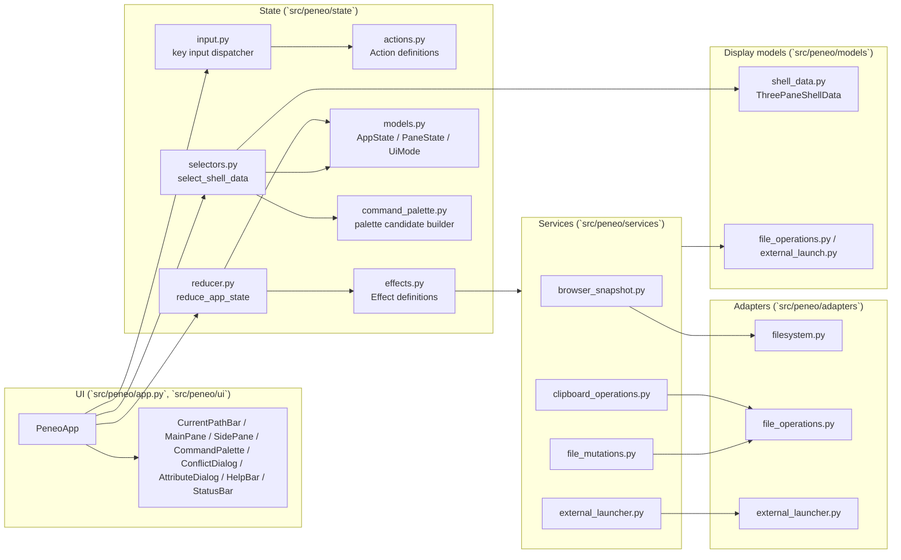
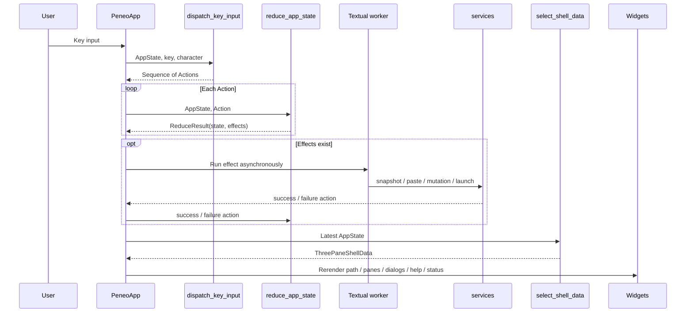
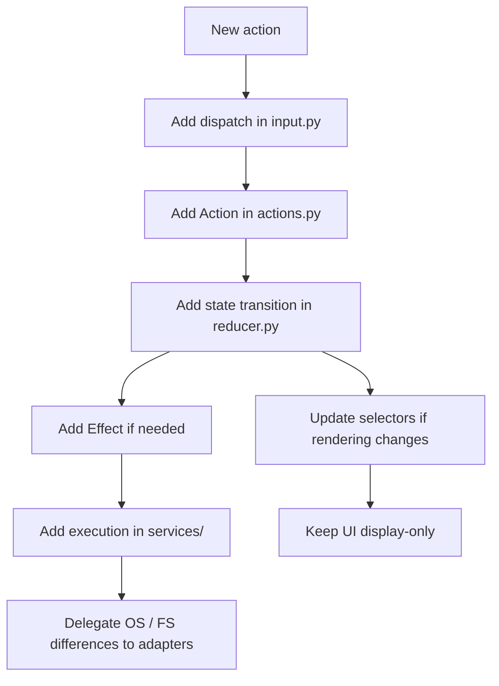

# Peneo Architecture Overview

This document gives a high-level view of the current implementation structure of `Peneo`.
It describes the actual responsibilities and data flow that exist in the codebase as of `2026-03-26`, not the full MVP vision.

## 1. Principles

The current implementation is built around these responsibilities:

- `UI`: Textual rendering and event entry points
- `input dispatcher`: normalizes key input into reducer-facing `Action` values
- `reducer`: updates `AppState` as a pure function and returns required side effects as `Effect`
- `selectors`: builds render-only models from `AppState`
- `services`: use-case boundaries that execute effects outside the reducer
- `adapters`: implementations for external dependencies such as the OS, filesystem, and clipboard

The design keeps branching logic out of widgets and centralizes state transitions under `state/`.

## 2. Overall Structure



## 3. Flow From Key Input To Rendering

The core flow is: input -> Action -> state update -> effect execution -> selector -> rerender.



## 4. Responsibilities Of Major Modules

### `src/peneo/app.py`

- `PeneoApp` assembles the whole application
- Sends Textual `Key` events into the central dispatcher
- Bridges reducer effects to workers and services
- Updates UI widgets using selector output

### `src/peneo/state/input.py`

- Normalizes key input into `Action` values by mode
- The main currently supported modes are `BROWSING`, `FILTER`, `RENAME`, `CREATE`, `PALETTE`, `CONFIRM`, and `BUSY`
- Absorbs context-dependent keys such as `Esc`

### `src/peneo/state/reducer.py`

- The single update point for `AppState`
- Manages screen transitions, cursor movement, selection, filter, sort, clipboard, rename/create/delete, palette execution, and dialog state
- Does not perform external I/O directly; instead returns `LoadBrowserSnapshotEffect`, `RunClipboardPasteEffect`, `RunFileMutationEffect`, and `RunExternalLaunchEffect`
- Matches async results by request id and discards stale snapshot results

### `src/peneo/state/selectors.py`

- Builds `ThreePaneShellData` from `AppState`
- Applies filter and sort only to the main pane, while parent and child panes stay fixed to name order plus directories-first
- Formats the display text for the help bar, status bar, input bar, command palette, conflict dialog, and attribute dialog
- Also assembles cut-item dimming and the summary line fields such as `item_count`, `selected_count`, and `sort_label`

### `src/peneo/state/command_palette.py`

- Builds command palette candidates and filters them by query
- The current palette includes `Find file`, `Show attributes`, `Copy path`, `Open in file manager`, `Open terminal here`, `Show/Hide hidden files`, `Create file`, and `Create directory`
- `Show attributes` appears only for a single target and opens a read-only attribute dialog with `Name`, `Type`, `Path`, `Size`, `Modified`, `Hidden`, and `Permissions`
- `Run shell command` may appear as a candidate, but it is still a placeholder with `enabled=False`

### `src/peneo/services/`

- `browser_snapshot.py`: builds the three-pane snapshot from the real filesystem
- `clipboard_operations.py`: handles copy / cut / paste execution and conflict detection
- `file_mutations.py`: handles rename / create / trash delete
- `external_launcher.py`: handles default-app open, editor-in-current-terminal launch, terminal launch, and copying a path to the system clipboard

### `src/peneo/adapters/`

- `filesystem.py`: enumerates directory entries and reads metadata
- `file_operations.py`: performs copy / move / rename / create / trash and related file operations
- `external_launcher.py`: hides OS-specific command differences and launches external processes

### `src/peneo/models/`

- `shell_data.py`: render-only models
- `external_launch.py` and `file_operations.py`: request / result models exchanged between services and the reducer
- `state/models.py`: state models managed by the reducer

## 5. Modes And Input Boundaries

```mermaid
stateDiagram-v2
    [*] --> BROWSING
    BROWSING --> FILTER: /
    BROWSING --> RENAME: F2
    BROWSING --> PALETTE: :
    PALETTE --> CREATE: Enter on create command
    PALETTE --> BROWSING: Enter on other command / Esc
    FILTER --> BROWSING: Enter / Down / Esc
    RENAME --> BUSY: Enter
    CREATE --> BUSY: Enter
    RENAME --> BROWSING: Esc
    CREATE --> BROWSING: Esc
    CONFIRM --> BROWSING: delete confirm/cancel
    CONFIRM --> BROWSING: paste conflict resolved/cancelled
    CONFIRM --> RENAME: rename conflict dismissed
    CONFIRM --> CREATE: create conflict dismissed
    BUSY --> BROWSING: effect completes

    BUSY --> BUSY: arbitrary keys are suppressed
```

Notes:

- `BROWSING`
  - Handles navigation, selection, starting filter input, paste, delete, rename, palette, and sort switching
  - If an active filter exists, `Esc` clears the filter before clearing the selection
- `FILTER`
  - Handles text input, `Backspace`, `Enter`, `Down`, and `Esc`
- `PALETTE`
  - Handles query updates, candidate cursor movement, command execution, and cancel
- `RENAME` / `CREATE`
  - Edits names in the input bar and issues a mutation effect on `Enter`
- `CONFIRM`
  - Handles delete confirmation, paste conflicts, and duplicate-name warnings for rename/create
- `BUSY`
  - Wait state while loading snapshots or executing file mutations

## 6. What Works Today

- Launches the three-pane UI by loading the real filesystem from `CWD`
- Shows parent / current / child panes and supports cursor movement
- Moves into directories, back to parent, and reloads the current directory
- Supports filter input and continued list interaction after applying the filter
- Switches sort by name / modified time / size and toggles directories-first ordering
- Supports selection toggle, clear selection, copy / cut / paste
- Detects paste conflicts and resolves them with overwrite / skip / rename
- Renames a single target
- Creates files and directories
- Moves items to trash and shows a confirmation dialog for multi-target deletion
- Opens files with the OS default app
- Opens files in the editor inside the current terminal
- Provides path copy, terminal launch, and hidden-files toggle from the command palette
- Keeps status bar / help bar / input bar / conflict dialog / attribute dialog synchronized with application state

## 7. Areas Still Unwired Or Unimplemented

- `HistoryState` exists in state, but back / forward is not wired into the UI yet
- `Run shell command` is still a non-executable placeholder in the command palette
- File preview, editing, Git integration, tabs, and keybinding customization are not implemented

Filesystem mutations treat the entry path selected in the UI as the trust boundary. When the selected item is a symlink, the final path component is not canonicalized, so delete / rename / move / copy / overwrite / trash operate on the symlink entry itself rather than silently following the target.

## 8. How To Extend It

When adding a new action, the intended insertion order is:



Following this path keeps feature changes localized without pushing branching logic into widgets.
