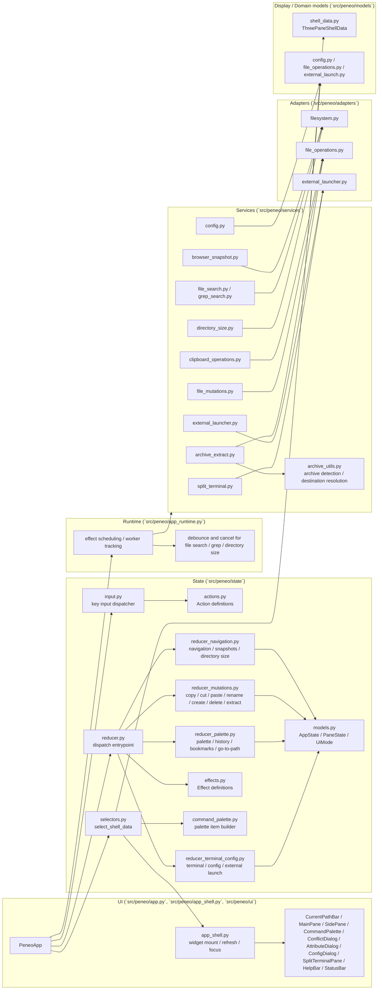
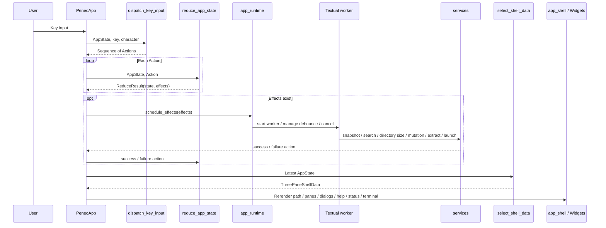
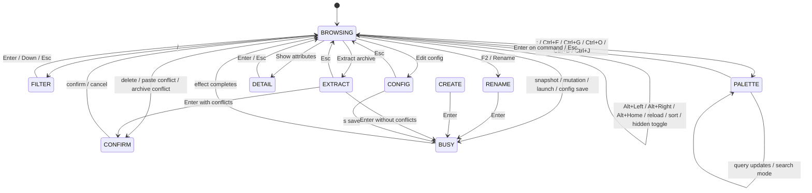
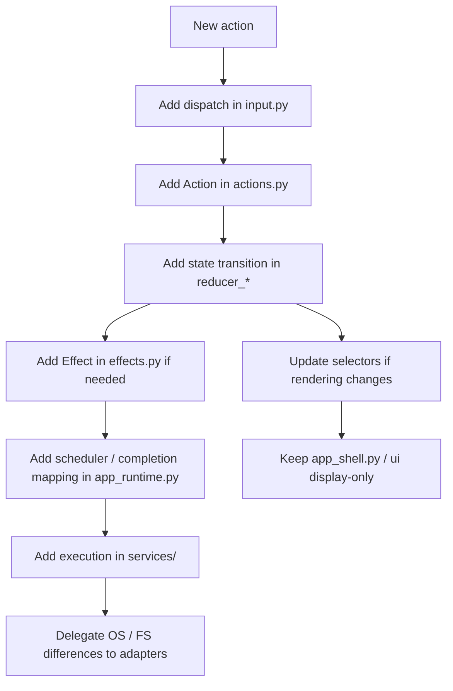

# Peneo Architecture Overview

This document gives a high-level view of the current implementation structure of `Peneo`.  
It describes the actual responsibilities and data flow that exist in the codebase as of `2026-04-02`, not the full MVP vision.

## 1. Principles

The current implementation is built around these responsibilities:

- `UI`: Textual widgets for rendering and event entry points
- `app runtime`: bridges reducer effects to workers and services, then maps async results back into actions
- `input dispatcher`: normalizes key input into reducer-facing `Action` values
- `reducer`: updates `AppState` as a pure function and returns required side effects as `Effect`
- `selectors`: builds render-only models from `AppState`
- `services`: use-case boundaries that execute effects outside the reducer
- `adapters`: implementations for external dependencies such as the OS, filesystem, and clipboard

The design keeps branching logic out of widgets and centralizes state transitions under `state/`.  
Actual UI refresh stays confined to selector-produced view models plus `app_shell.py`, while async orchestration is split into `app_runtime.py`.

## 2. Overall Structure

## 3. Flow From Key Input To Rendering

The core flow is: input -> Action -> state update -> effect execution -> selector -> rerender.  
Search work and directory-size calculation use `app_runtime.py` for debounce and cancellation, and stale request ids are discarded by the reducer.

## 4. Responsibilities Of Major Modules

### `src/peneo/app.py`

- `PeneoApp` assembles the whole application
- Sends Textual `Key` events into the central dispatcher
- Passes reducer effects into `app_runtime.py`
- Updates the UI shell from selector output

### `src/peneo/app_runtime.py`

- Chooses how each effect is scheduled as a worker
- Manages debounce, request ids, and cancellation for file search, grep search, and directory-size work
- Normalizes service results and exceptions into reducer-facing actions
- Tracks longer-lived work such as snapshots and split-terminal sessions

### `src/peneo/app_shell.py`

- Mounts and refreshes the widget tree for the three-pane browser, dialogs, and split terminal
- Applies selector-generated view models to widgets
- Handles split-terminal focus and terminal-size synchronization

### `src/peneo/state/input.py`

- Normalizes key input into `Action` values by mode
- The main supported modes are `BROWSING`, `FILTER`, `RENAME`, `CREATE`, `EXTRACT`, `PALETTE`, `DETAIL`, `CONFIRM`, `CONFIG`, and `BUSY`
- When the split terminal owns input, browser shortcuts are bypassed in favor of terminal input
- Also absorbs compound shortcuts such as `Ctrl+F`, `Ctrl+G`, `Ctrl+O`, `Ctrl+B`, `Ctrl+J`, `Alt+Left`, `Alt+Right`, and `Alt+Home`

### `src/peneo/state/reducer.py`

- The single public update point for `AppState`
- Acts as a thin entrypoint that delegates work to responsibility-specific reducer handlers

### `src/peneo/state/reducer_navigation.py`

- Handles directory movement, history back / forward, home navigation, reload, filter, sort, and hidden-files toggling
- Also applies browser snapshots, child-pane snapshots, directory-size requests, and directory-size results

### `src/peneo/state/reducer_mutations.py`

- Handles selection, copy / cut / paste, rename, create, trash delete, and archive-extract transitions
- Owns paste-conflict, name-conflict, archive-confirmation, and extraction-progress state

### `src/peneo/state/reducer_palette.py`

- Handles command-palette open / close, query updates, cursor movement, and execution
- Starts derived flows such as `Find files`, `Grep search`, `History search`, `Show bookmarks`, `Go to path`, bookmark add/remove, `Show attributes`, and `Extract archive`
- Also owns attribute-dialog dismissal and file-search / grep-search result application

### `src/peneo/state/reducer_terminal_config.py`

- Handles split-terminal start / stop / I/O
- Handles config-editor edits and saves, bookmark persistence, external-app launch, and terminal-editor launch

### `src/peneo/state/selectors.py`

- Builds `ThreePaneShellData` from `AppState`
- Applies filter, sort, and directory-size display only to the main pane, while parent and child panes remain fixed-order
- Formats display text for the help bar, status bar, input bar, command palette, conflict dialog, attribute dialog, config dialog, and split terminal
- Summarizes busy state, extraction progress, search errors, and notifications for the UI

### `src/peneo/state/command_palette.py`

- Builds palette items and filters them by query
- The default command palette includes:
  - `Find files`
  - `Grep search`
  - `History search`
  - `Show bookmarks`
  - `Go back`
  - `Go forward`
  - `Go to path`
  - `Go to home directory`
  - `Reload directory`
  - `Toggle split terminal`
  - `Show attributes`
  - `Rename`
  - `Extract archive`
  - `Open in editor`
  - `Copy path`
  - `Move to trash`
  - `Open in file manager`
  - `Open terminal here`
  - `Bookmark this directory` / `Remove bookmark`
  - `Show hidden files` / `Hide hidden files`
  - `Edit config`
  - `Create file`
  - `Create directory`
- Palette sources are `commands`, `file_search`, `grep_search`, `history`, `bookmarks`, and `go_to_path`
- `go_to_path` shows matching directory candidates while the user types and lets `Tab` complete the selected one

### `src/peneo/services/`

- `browser_snapshot.py`: builds the three-pane snapshot from the real filesystem
- `file_search.py`: handles recursive file search under the current directory
- `grep_search.py`: handles recursive content search through `rg`
- `directory_size.py`: calculates recursive sizes for visible directories
- `clipboard_operations.py`: executes copy / cut / paste and detects conflicts
- `file_mutations.py`: handles rename / create / trash delete
- `archive_extract.py`: handles archive preflight scanning, conflict detection, safe extraction, and progress reporting
- `config.py`: loads, validates, saves, and renders `config.toml`
- `external_launcher.py`: handles default-app launch, terminal-editor launch, external-terminal launch, and path copy
- `split_terminal.py`: starts PTY-backed split-terminal sessions, forwards I/O, and reports exit events

### `src/peneo/archive_utils.py`

- Detects supported archive formats
- Resolves default extraction destinations and user-entered relative or absolute destination paths

### `src/peneo/adapters/`

- `filesystem.py`: enumerates entries, reads metadata, and calculates directory sizes
- `file_operations.py`: performs copy / move / rename / create / trash and archive-related file operations
- `external_launcher.py`: hides OS-specific launch command differences

### `src/peneo/models/` and `src/peneo/state/models.py`

- `models/` stores request / result / view-model types shared across services and UI
- `state/models.py` stores reducer-owned persistent state
- Cross-cutting UI state such as `HistoryState`, `CommandPaletteState`, `SplitTerminalState`, and `DirectorySizeCacheEntry` lives under `state/models.py`

## 5. Modes And Input Boundaries

Notes:

- `BROWSING`
  - Handles navigation, selection, history movement, bookmark / history / go-to-path entry, filter, palette, sort, and terminal toggling
  - If an active filter exists, `Esc` clears the filter before clearing selection
- `PALETTE`
  - Reuses one UI surface for normal commands plus file search, grep search, history, bookmarks, and go-to-path preview
- `DETAIL`
  - Read-only mode for the attribute dialog
- `EXTRACT`
  - Shows the extraction-destination input and moves into preflight checking or extraction on `Enter`
- `CONFIG`
  - Edits startup settings in the config overlay, saves with `s`, and opens raw `config.toml` in a terminal editor with `e`
- While the split terminal is visible
  - Terminal input takes precedence over browser shortcuts, and `Ctrl+T` or `Esc` closes it

## 6. What Works Today

- Launches the three-pane UI from the real filesystem rooted at `CWD`
- Shows parent / current / child directories and supports cursor movement
- Moves into directories, back to the parent directory, to the home directory, and reloads the current directory
- Supports back / forward history navigation and jumping from the history list
- Supports jumping from saved bookmarks plus adding or removing the current directory as a bookmark
- Supports go-to-path input for direct navigation to a typed path
- Supports filter input and continued list interaction after filtering
- Switches sort by name / modified time / size and toggles directories-first ordering
- Shows recursive directory sizes for visible directories when needed
- Supports selection toggle, clear selection, copy / cut / paste
- Detects paste conflicts and resolves them with overwrite / skip / rename
- Renames a single target
- Creates files and directories
- Moves items to trash with confirmation
- Opens files with the OS default app
- Opens files in the current terminal editor with `e`
- Provides recursive file search, recursive grep search, attribute inspection, path copy, file-manager launch, external-terminal launch, and hidden-files toggling from the command palette
- Extracts supported archives (`.zip`, `.tar`, `.tar.gz`, `.tar.bz2`) with conflict confirmation and progress reporting
- Saves startup settings and bookmarks through the config overlay
- Starts the embedded split terminal, forwards input, supports clipboard paste, and reports exit events
- Keeps status bar, help bar, input bar, conflict dialog, attribute dialog, config dialog, and split terminal synchronized with application state

## 7. Areas Still Unimplemented Or Constrained

- File preview, in-app editing, Git integration, tabs, and keybinding customization are not implemented
- Native Windows runtime remains unsupported, even though the config accepts a `windows` terminal key for future compatibility
- Directory-size calculation and archive extraction grow in cost with visible directory count or archive contents, so runtime cancellation and progress tracking are part of the design

Filesystem mutations treat the entry path selected in the UI as the trust boundary.  
When the selected item is a symlink, the final path component is not canonicalized, so delete / rename / move / copy / overwrite / trash operate on the symlink entry itself rather than silently following the target.

## 8. How To Extend It

When adding a new action, the intended insertion order is:

Following this path keeps feature changes localized without pushing branching logic into widgets.
