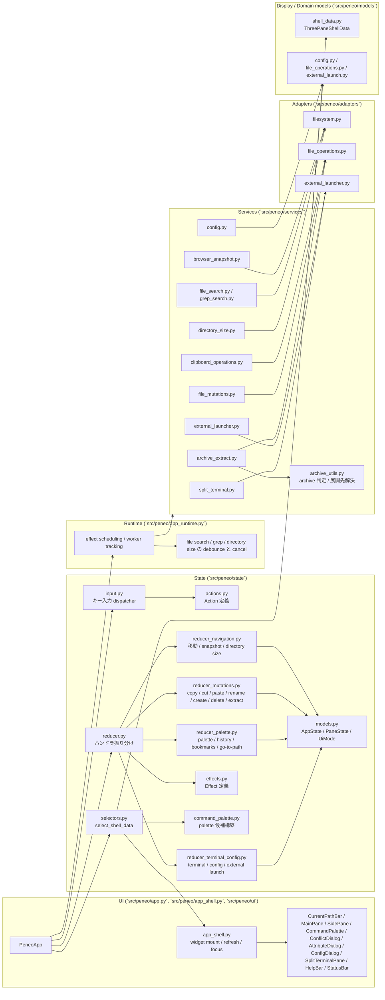
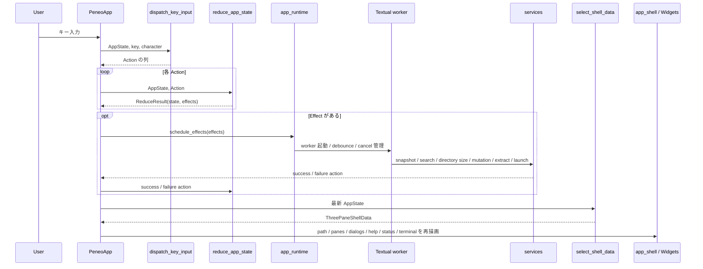
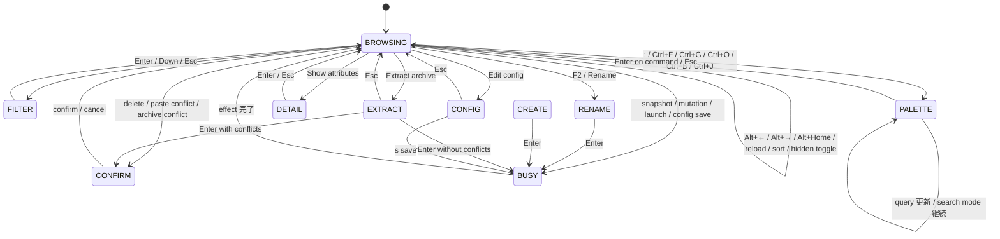
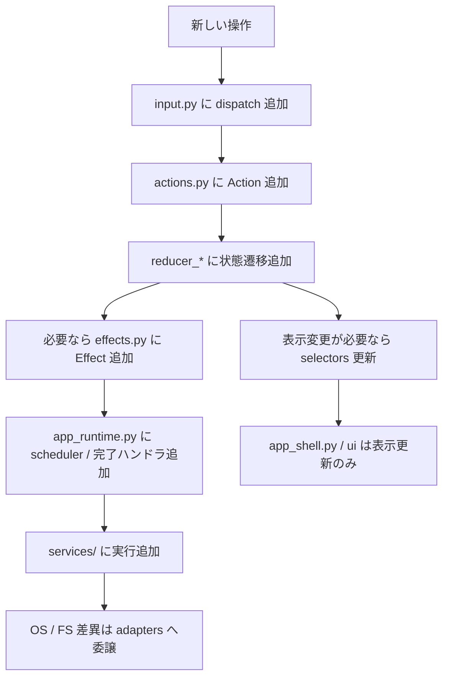

# Peneo アーキテクチャ概要

このドキュメントは、`Peneo` の現在の実装構造を俯瞰するためのものです。  
対象は `2026-04-02` 時点でコード上に存在する責務分割とデータフローであり、MVP 構想全体ではなく現実装を説明します。

## 1. 方針

現在の実装は、次の責務分離を前提にしています。

- `UI`: Textual widget の描画とイベント入口
- `app runtime`: reducer が返した effect を worker と service に橋渡しし、非同期結果を action へ戻す
- `input dispatcher`: キー入力を reducer 向け `Action` に正規化
- `reducer`: `AppState` を純粋関数で更新し、必要な副作用を `Effect` として返す
- `selectors`: `AppState` から描画専用モデルを組み立てる
- `services`: reducer 外で effect を実行するユースケース境界
- `adapters`: OS / filesystem / clipboard など外部依存の実装

widget 側に操作分岐を持たせず、状態遷移は `state/` に寄せる構成です。  
実際の UI 更新は `selectors` が作る view model と `app_shell.py` の組み立て処理に限定し、非同期処理の制御は `app_runtime.py` に分離しています。

## 2. 全体構成

## 3. キー入力から描画までの流れ

中核フローは「入力 -> Action -> 状態更新 -> Effect 実行 -> Selector -> 再描画」です。  
検索系と directory size 計算は `app_runtime.py` 側で debounce と cancel を扱い、古い request id の結果は reducer で破棄します。

## 4. 主要モジュールの責務

### `src/peneo/app.py`

- `PeneoApp` がアプリ全体の組み立て役
- Textual の `Key` イベントを中央 dispatcher に流す
- reducer が返した effect を `app_runtime.py` に橋渡しする
- selector の結果を使って UI shell を更新する

### `src/peneo/app_runtime.py`

- effect ごとに worker 起動方法を切り替える
- file search / grep search / directory size の debounce、request id 管理、cancel 制御を担当する
- service の結果や例外を reducer 向け action に正規化する
- snapshot や split terminal など長寿命処理の tracking を行う

### `src/peneo/app_shell.py`

- 3 ペイン本体、dialog、split terminal を含む widget ツリーの mount / refresh を担当する
- selector が返した view model を各 widget へ反映する
- split terminal の focus 制御と terminal サイズ同期を行う

### `src/peneo/state/input.py`

- モード別にキー入力を `Action` へ正規化する
- 現在サポートしている主なモードは `BROWSING` / `FILTER` / `RENAME` / `CREATE` / `EXTRACT` / `PALETTE` / `DETAIL` / `CONFIRM` / `CONFIG` / `BUSY`
- split terminal が入力を持つ間は browser 用キーバインドではなく terminal 入力を優先する
- `Ctrl+F` / `Ctrl+G` / `Ctrl+O` / `Ctrl+B` / `Ctrl+J` / `Alt+←` / `Alt+→` / `Alt+Home` などの複合キーもここで吸収する

### `src/peneo/state/reducer.py`

- `AppState` の唯一の公開更新点
- 実処理は責務別ハンドラへ振り分ける薄いエントリポイントとして振る舞う

### `src/peneo/state/reducer_navigation.py`

- ディレクトリ移動、history 戻る / 進む、home 移動、reload、filter、sort、hidden files 切り替えを担当する
- browser snapshot と child pane snapshot の反映、directory size request の発行と結果反映もここで扱う

### `src/peneo/state/reducer_mutations.py`

- 選択、copy / cut / paste、rename、create、trash delete、archive extract の state 遷移を担当する
- paste conflict、name conflict、archive extract confirm、進捗表示の各状態を管理する

### `src/peneo/state/reducer_palette.py`

- コマンドパレットの開閉、query 更新、候補カーソル移動、実行を担当する
- `Find files`、`Grep search`、`History search`、`Show bookmarks`、`Go to path`、bookmark add/remove、`Show attributes`、`Extract archive` などの派生フローを起動する
- 属性ダイアログの開閉や file search / grep search の結果反映もここで扱う

### `src/peneo/state/reducer_terminal_config.py`

- split terminal の起動 / 終了 / 入出力を担当する
- config editor の編集と保存、bookmark 保存、外部アプリ起動、terminal editor 起動を担当する

### `src/peneo/state/selectors.py`

- `AppState` から `ThreePaneShellData` を組み立てる
- 中央ペインにだけ filter / sort / directory size 表示を適用し、親・子ペインは固定順で表示する
- help bar、status bar、input bar、command palette、conflict dialog、attribute dialog、config dialog、split terminal の表示文言を整形する
- busy 状態、extract 進捗、検索エラー、通知メッセージを UI 向けに要約する

### `src/peneo/state/command_palette.py`

- palette 候補の構築と query フィルタリングを担当する
- 通常 palette には次の候補がある
  - `Find files`
  - `Grep search`
  - `History search`
  - `Show bookmarks`
  - `Go back`
  - `Go forward`
  - `Go to path`
  - `Go to home directory`
  - `Reload directory`
  - `Toggle split terminal`
  - `Show attributes`
  - `Rename`
  - `Extract archive`
  - `Open in editor`
  - `Copy path`
  - `Move to trash`
  - `Open in file manager`
  - `Open terminal here`
  - `Bookmark this directory` / `Remove bookmark`
  - `Show hidden files` / `Hide hidden files`
  - `Edit config`
  - `Create file`
  - `Create directory`
- palette source は `commands` / `file_search` / `grep_search` / `history` / `bookmarks` / `go_to_path` を持つ
- `go_to_path` は入力中に一致するディレクトリ候補を複数表示し、`Tab` で選択候補を補完できる

### `src/peneo/services/`

- `browser_snapshot.py`: 実 filesystem から 3 ペイン用 snapshot を構築する
- `file_search.py`: 現在ディレクトリ以下の再帰ファイル検索を担当する
- `grep_search.py`: `rg` を使った再帰内容検索を担当する
- `directory_size.py`: 可視ディレクトリの再帰サイズ計算を担当する
- `clipboard_operations.py`: copy / cut / paste 実処理と競合検出を担当する
- `file_mutations.py`: rename / create / trash delete を担当する
- `archive_extract.py`: archive 事前走査、競合検出、安全な展開、進捗通知を担当する
- `config.py`: `config.toml` の読み込み、検証、保存、既定値レンダリングを担当する
- `external_launcher.py`: 既定アプリ起動、terminal editor 起動、外部 terminal 起動、パスコピーを担当する
- `split_terminal.py`: 埋め込み split terminal の PTY セッション起動、入出力、終了通知を担当する

### `src/peneo/archive_utils.py`

- 対応 archive 形式の判定を行う
- 展開先の既定値生成と、ユーザー入力された相対 / 絶対パスの解決を担当する

### `src/peneo/adapters/`

- `filesystem.py`: ディレクトリエントリ列挙、メタデータ取得、directory size 計算を担当する
- `file_operations.py`: copy / move / rename / create / trash / archive 展開補助などのファイル操作を担当する
- `external_launcher.py`: OS ごとの起動コマンド差異を吸収する

### `src/peneo/models/` と `src/peneo/state/models.py`

- `models/` には service と UI が共有する request / result / view model を置く
- `state/models.py` には reducer 管理下の永続 state を置く
- `HistoryState`、`CommandPaletteState`、`SplitTerminalState`、`DirectorySizeCacheEntry` などの UI 横断状態は `state/models.py` 側に集約する

## 5. モードと入力境界

補足:

- `BROWSING`
  - 移動、選択、履歴移動、bookmark / history / go-to-path 起動、filter、palette、sort、terminal 切り替えを処理する
  - `Esc` は active filter が残っている場合、選択解除より先に filter 解除を優先する
- `PALETTE`
  - 通常コマンドだけでなく、file search / grep search / history / bookmarks / go-to-path preview の各 source を同一 UI で扱う
- `DETAIL`
  - read-only 属性ダイアログを閉じるだけのモード
- `EXTRACT`
  - archive 展開先の入力バーを表示し、`Enter` で事前チェックまたは展開開始へ進む
- `CONFIG`
  - config overlay 上で起動時設定を編集し、`s` で保存し、`e` で生の `config.toml` を terminal editor で開く
- split terminal 可視時
  - 通常の browse 用キーバインドではなく terminal 入力が優先され、`Ctrl+T` または `Esc` で閉じる

## 6. 現在できること

- `CWD` から実 filesystem を読み込んで 3 ペイン UI を起動
- 親 / 現在 / 子ディレクトリ表示とカーソル移動
- ディレクトリ移動、親ディレクトリ復帰、home 移動、再読み込み
- back / forward 履歴移動と履歴一覧からのジャンプ
- bookmark 一覧からのジャンプと、現在ディレクトリの bookmark 追加 / 削除
- go-to-path 入力による任意パスへの移動
- filter 入力と filter 適用後の一覧継続操作
- 名前 / 更新日時 / サイズソートと directory-first 切り替え
- 必要に応じた可視ディレクトリの再帰サイズ表示
- 選択トグル、選択解除、copy / cut / paste
- 貼り付け時の競合検出と overwrite / skip / rename の解決
- 単一対象の rename
- 新規ファイル / 新規ディレクトリ作成
- ゴミ箱への削除と確認ダイアログ
- ファイルの既定アプリ起動
- `e` による現在の terminal 内 editor 起動
- コマンドパレットからの再帰 file search、再帰 grep search、属性表示、path copy、既定 file manager 起動、外部 terminal 起動、hidden files 切り替え
- 対応 archive (`.zip` / `.tar` / `.tar.gz` / `.tar.bz2`) の展開、競合確認、進捗表示
- config overlay による起動時設定と bookmark の保存
- 埋め込み split terminal の起動、入力、clipboard paste、終了通知
- status bar / help bar / input bar / conflict dialog / attribute dialog / config dialog / split terminal の状態連動表示

## 7. 現時点で未実装または限定的な範囲

- ファイル内容プレビュー、アプリ内編集、Git 連携、タブ機能、キーバインドカスタマイズは未実装
- Windows ネイティブ実行は依然として非対応で、設定上の `windows` キーは将来互換用
- directory size 計算や archive 展開は可視対象数やアーカイブ内容に応じてコストが増えるため、runtime 側で cancel と進捗管理を前提にしている

filesystem mutation は、UI が選択している entry path をそのまま trust boundary として扱います。  
選択対象が symlink の場合でも最終パス要素を canonicalize せず、delete / rename / move / copy / overwrite / trash は symlink 自体に作用させます。

## 8. 拡張時の差し込み方

新しい操作を追加する場合は、基本的に次の順で差し込みます。

この流れを守ることで、widget ごとの分岐を増やさずに機能追加を局所化できます。
