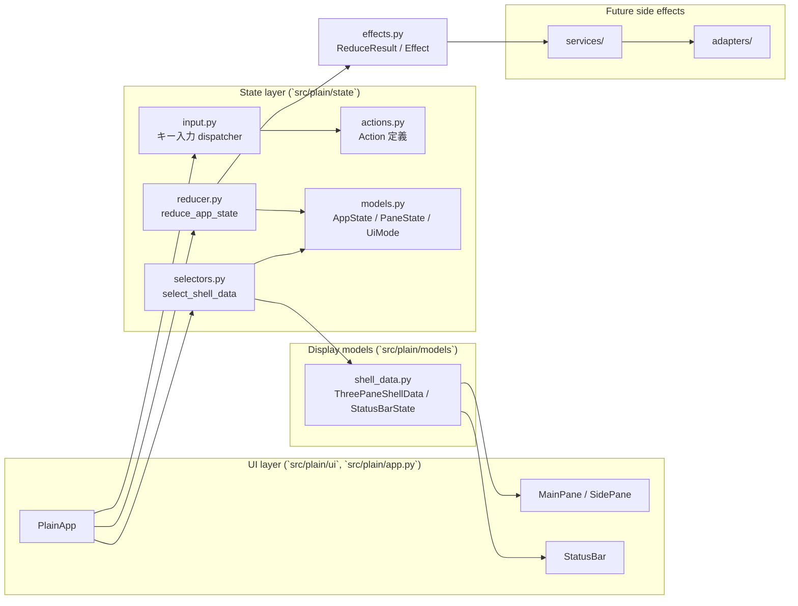
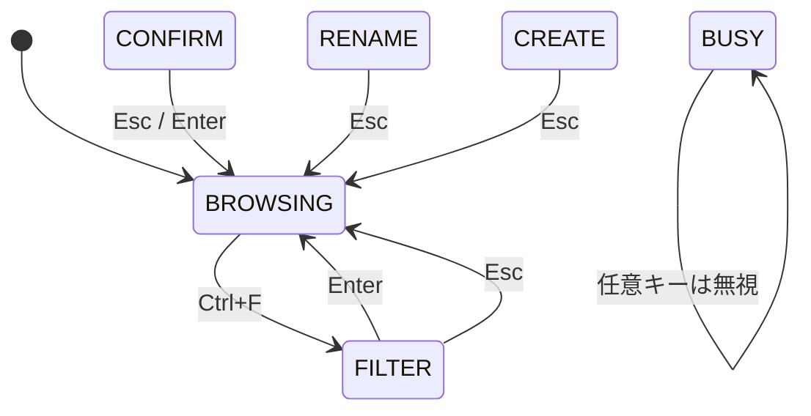
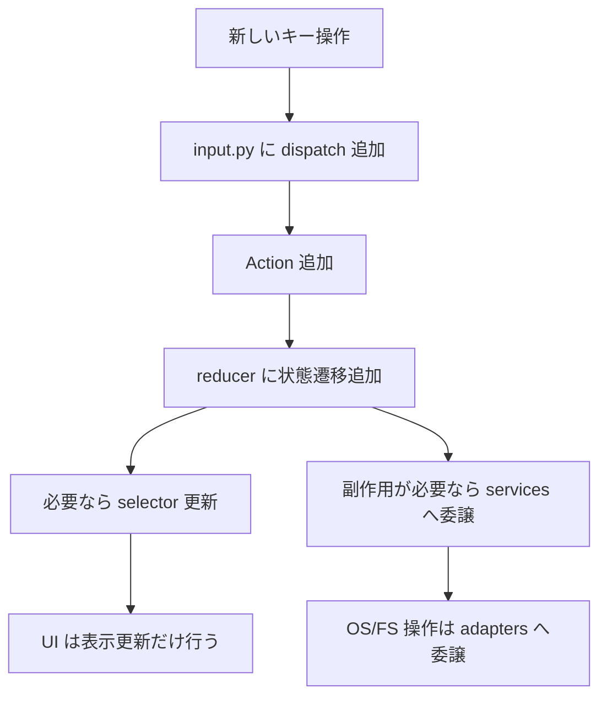

# Plain アーキテクチャ概要

このドキュメントは、現在の `Plain` の実装構造を俯瞰するためのものです。  
MVP 仕様全体ではなく、`2026-03-22` 時点でコード上に存在する責務分割とデータフローを対象にします。

## 1. 目的

現在の実装は、以下を明確に分離する方針で組まれています。

- `UI`: 表示と Textual イベント受け取り
- `input dispatcher`: キー入力を `Action` に正規化
- `reducer`: `AppState` を純粋関数で更新
- `selectors`: `AppState` を表示用モデルへ変換
- `models`: 表示モデルと状態モデル
- `services/adapters`: 副作用や OS / filesystem 依存処理の受け皿

## 2. 全体構成

## 3. キー入力から描画までの流れ

現在の中核フローは「入力 -> Action -> 状態更新 -> Effect 実行 -> Selector -> 再描画」です。

## 4. ディレクトリ責務

### `src/plain/app.py`

- `PlainApp` がアプリ全体の組み立て役
- Textual の `Key` イベントを受ける
- `dispatch_key_input()` と `reduce_app_state()` を呼ぶ
- reducer が返した effect を Textual worker で実行する
- selector の結果を使って UI を再描画する

### `src/plain/ui/`

- `MainPane`, `SidePane`, `StatusBar` は表示責務に限定
- widget 自体はキー意味の分岐を持たない
- 現在の入力解釈は app / state 側で一元管理する

### `src/plain/state/actions.py`

- reducer が受け取る入力単位を定義する
- 現在は次のような Action がある
  - UI モード変更
  - カーソル移動
  - 選択トグル
  - フィルタ開始 / 確定 / 取消し
- 通知更新
- browser snapshot 読み込み成功 / 失敗
- child pane 読み込み成功 / 失敗

### `src/plain/state/input.py`

- `ui_mode` ごとに同じキーの意味を切り替える
- `BROWSING`, `FILTER`, `CONFIRM`, `BUSY` の入力を現在サポート
- 未サポート入力は warning message に変換する

### `src/plain/state/reducer.py`

- `AppState` を純粋関数で更新する
- 副作用を直接持たず、`ReduceResult(state, effects)` を返す
- カーソル移動時に child pane の再取得要否を決める
- full snapshot と child snapshot の stale 結果を request id で破棄する

### `src/plain/state/selectors.py`

- `AppState` を UI 用の `ThreePaneShellData` に変換する
- フィルタとソートをここで適用する
- ステータスバー表示文字列の元データもここで組み立てる

### `src/plain/models/`

- `shell_data.py` は描画専用モデル
- `state/models.py` は reducer 管理対象のアプリ状態
- `services/browser_snapshot.py` は 3 ペイン snapshot の組み立てを担う
- `adapters/filesystem.py` はローカル filesystem から `DirectoryEntryState` を構築する

## 5. 現在のモードと入力境界

補足:

- `BROWSING`
  - `Up`, `Down`, `Space`, `Esc`, `Ctrl+F` を処理
- `FILTER`
  - 文字入力、`Backspace`, `Space`, `Enter`, `Esc` を処理
- `CONFIRM`, `BUSY`
  - 土台だけあり、通常フローからはまだ本格利用していない
- `RENAME`, `CREATE`
  - 型と退避先はあるが、まだ本実装前

## 6. 現在できること / まだできないこと

### できること

- `CWD` を起点に実ファイルシステムの 3 ペイン UI を起動
- 可視行のカーソル移動
- 選択トグルと全解除
- フィルタ入力と再帰フラグ切り替え
- モード別キー解釈
- ステータスバーへの warning / error 通知表示
- child pane の必要時のみ再取得

### まだできないこと

- 実ディレクトリ移動
- ファイル open / copy / cut / paste / rename / delete / create
- 履歴移動や sort 切り替えの UI 操作

## 7. 今後の拡張ポイント

将来の実装は、基本的に次の順で差し込む想定です。

この流れを守ることで、widget ごとの分岐追加を避けつつ、操作の追加を局所化できます。
