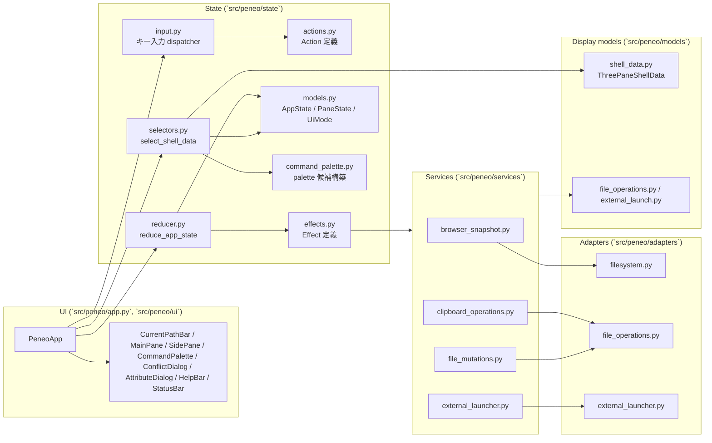
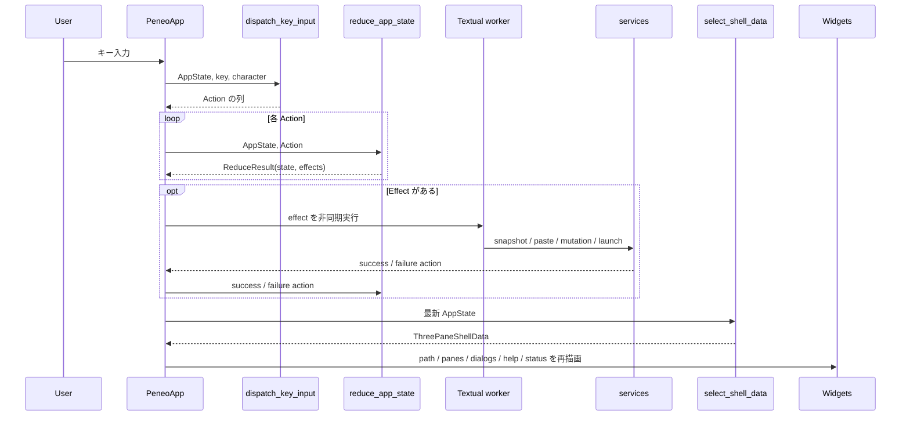
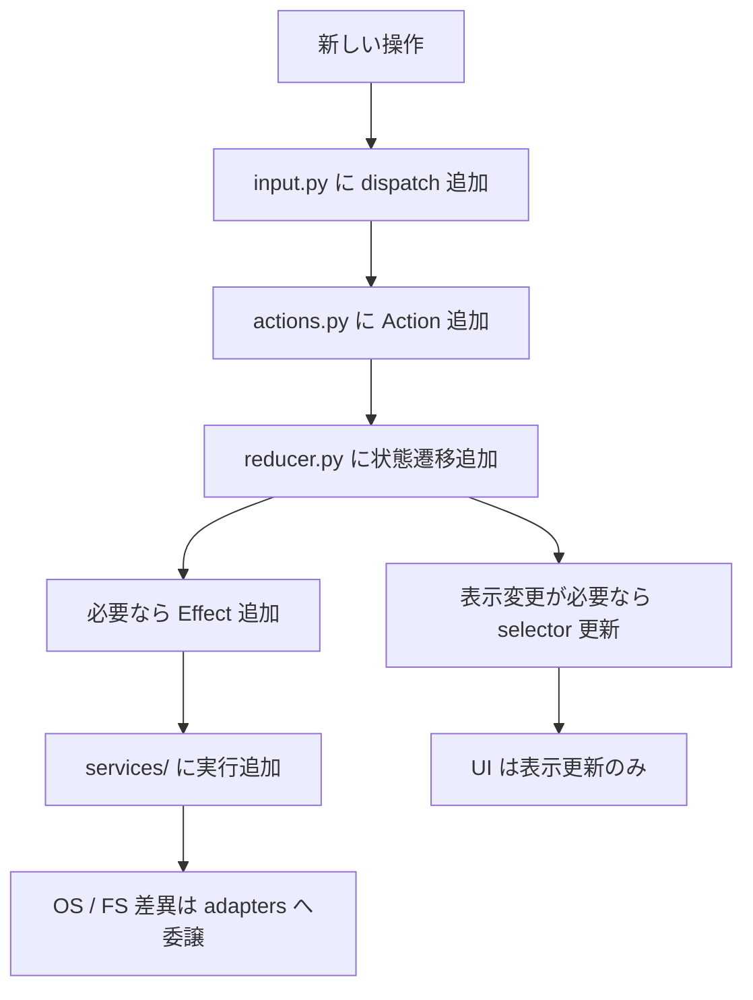

# Peneo アーキテクチャ概要

このドキュメントは、`Peneo` の現在の実装構造を俯瞰するためのものです。  
対象は `2026-03-26` 時点でコード上に存在する責務分割とデータフローであり、MVP 構想全体ではなく現実装を説明します。

## 1. 方針

現在の実装は、次の責務分離を前提にしています。

- `UI`: Textual の表示とイベント入口
- `input dispatcher`: キー入力を reducer 向け `Action` に正規化
- `reducer`: `AppState` を純粋関数で更新し、必要な副作用を `Effect` として返す
- `selectors`: `AppState` から描画専用モデルを組み立てる
- `services`: reducer 外で effect を実行するユースケース境界
- `adapters`: OS / filesystem / clipboard など外部依存の実装

widget 側に操作分岐を持たせず、状態遷移は `state/` に寄せる構成です。

## 2. 全体構成



## 3. キー入力から描画までの流れ

中核フローは「入力 -> Action -> 状態更新 -> Effect 実行 -> Selector -> 再描画」です。



## 4. 主要モジュールの責務

### `src/peneo/app.py`

- `PeneoApp` がアプリ全体の組み立て役
- Textual の `Key` イベントを中央 dispatcher に流す
- reducer が返した effect を worker と各 service に橋渡しする
- selector の結果を使って UI widget を更新する

### `src/peneo/state/input.py`

- モード別にキー入力を `Action` へ正規化する
- 現在サポートしている主なモードは `BROWSING` / `FILTER` / `RENAME` / `CREATE` / `PALETTE` / `CONFIRM` / `BUSY`
- `Esc` のように文脈で意味が変わるキーもここで吸収する

### `src/peneo/state/reducer.py`

- `AppState` の唯一の更新点
- 画面遷移、カーソル移動、選択、filter、sort、clipboard、rename/create/delete、palette 実行、dialog 状態を管理する
- 外部 I/O は直接行わず、`LoadBrowserSnapshotEffect`、`RunClipboardPasteEffect`、`RunFileMutationEffect`、`RunExternalLaunchEffect` を返す
- 非同期結果は request id で突き合わせ、古い snapshot 結果を破棄する

### `src/peneo/state/selectors.py`

- `AppState` から `ThreePaneShellData` を組み立てる
- 中央ペインにだけ filter / sort を適用し、親・子ペインは名前順 + ディレクトリ優先で固定表示する
- help bar、status bar、input bar、command palette、conflict dialog、attribute dialog の表示文言もここで整形する
- cut 対象の dim 表示や summary 行の `item_count / selected_count / sort_label` も selector 側で組み立てる

### `src/peneo/state/command_palette.py`

- コマンドパレット候補の構築と query フィルタリングを担当する
- 現在の palette には `Find file`、`Show attributes`、`Copy path`、`Open in file manager`、`Open terminal here`、`Open/Close split terminal`、`Show/Hide hidden files`、`Create file`、`Create directory` がある
- `Show attributes` は単一対象がある場合にだけ表示し、`Name` / `Type` / `Path` / `Size` / `Modified` / `Hidden` / `Permissions` を持つ read-only の属性ダイアログを開く
- `Find file` 選択後は palette をファイル検索モードに切り替え、現在ディレクトリ以下を再帰検索した結果を同じ UI で表示する

### `src/peneo/services/`

- `browser_snapshot.py`: 実 filesystem から 3 ペイン用 snapshot を構築
- `clipboard_operations.py`: copy / cut / paste の実処理と競合検出を担当
- `file_search.py`: 現在ディレクトリ以下の再帰ファイル検索を担当し、hidden 設定に応じて結果を絞る
- `file_mutations.py`: rename / create / trash delete を担当
- `external_launcher.py`: 既定アプリ起動、現在のターミナル内エディタ起動、ターミナル起動、システムクリップボードへのパスコピーを担当

### `src/peneo/adapters/`

- `filesystem.py`: ディレクトリエントリの列挙とメタデータ取得
- `file_operations.py`: copy / move / rename / create / trash などのファイル操作
- `external_launcher.py`: OS ごとのコマンド差異を吸収して外部プロセスを起動

### `src/peneo/models/`

- `shell_data.py`: 描画専用モデル
- `external_launch.py` と `file_operations.py`: service と reducer が受け渡す request / result モデル
- `state/models.py`: reducer 管理対象の状態モデル

## 5. モードと入力境界

```mermaid
stateDiagram-v2
    [*] --> BROWSING
    BROWSING --> FILTER: /
    BROWSING --> RENAME: F2
    BROWSING --> PALETTE: :
    PALETTE --> CREATE: Enter on create command
    PALETTE --> PALETTE: Enter on Find file / type file-search query
    PALETTE --> BROWSING: Enter on other command / Esc
    FILTER --> BROWSING: Enter / Down / Esc
    RENAME --> BUSY: Enter
    CREATE --> BUSY: Enter
    RENAME --> BROWSING: Esc
    CREATE --> BROWSING: Esc
    CONFIRM --> BROWSING: delete confirm/cancel
    CONFIRM --> BROWSING: paste conflict resolved/cancelled
    CONFIRM --> RENAME: rename conflict dismissed
    CONFIRM --> CREATE: create conflict dismissed
    BUSY --> BROWSING: effect 完了

    BUSY --> BUSY: 任意キーは抑止
```

補足:

- `BROWSING`
  - 移動、選択、filter 開始、paste、delete、rename、palette、sort 切り替えを処理する
  - `Esc` は active filter が残っている場合、選択解除より先に filter 解除を優先する
- `FILTER`
  - 文字入力、`Backspace`、`Enter`、`Down`、`Esc` を処理する
- `PALETTE`
  - query 更新、候補カーソル移動、コマンド実行、キャンセルを処理する
- `RENAME` / `CREATE`
  - 入力バーで名前を編集し、`Enter` で mutation effect を発行する
- `CONFIRM`
  - delete 確認、paste conflict、rename/create の重複名警告を扱う
- `BUSY`
  - snapshot 読み込みや file mutation 実行中の待機状態

## 6. 現在できること

- `CWD` から実ファイルシステムを読み込んで 3 ペイン UI を起動
- 親 / 現在 / 子ディレクトリ表示とカーソル移動
- ディレクトリへの移動、親ディレクトリへの復帰、再読み込み
- filter 入力と filter 適用後の一覧継続操作
- 名前 / 更新日時 / サイズソートとディレクトリ優先表示切り替え
- 選択トグル、選択解除、copy / cut / paste
- 貼り付け時の競合検出と overwrite / skip / rename の解決
- 単一対象の rename
- 新規ファイル / 新規ディレクトリ作成
- ゴミ箱への削除と複数対象削除時の確認ダイアログ
- ファイルの既定アプリ起動
- ファイルの現在のターミナル内エディタ起動
- コマンドパレットからの path copy、既定ファイラー起動、terminal 起動、hidden files 切り替え
- status bar / help bar / input bar / conflict dialog / attribute dialog の状態連動表示

## 7. 現時点で未接続または未実装の範囲

- `HistoryState` は state にあるが、戻る / 進む操作としてはまだ UI に接続していない
- ファイル内容プレビュー、編集、Git 連携、タブ機能、キーバインドカスタマイズは未実装

filesystem mutation は、UI が選択している entry path をそのまま trust boundary として扱う。選択対象が symlink の場合でも最終パス要素を canonicalize せず、delete / rename / move / copy / overwrite / trash は symlink 自体に作用させる。

## 8. 拡張時の差し込み方

新しい操作を追加する場合は、基本的に次の順で差し込みます。



この流れを守ることで、widget ごとの分岐を増やさずに機能追加を局所化できます。
