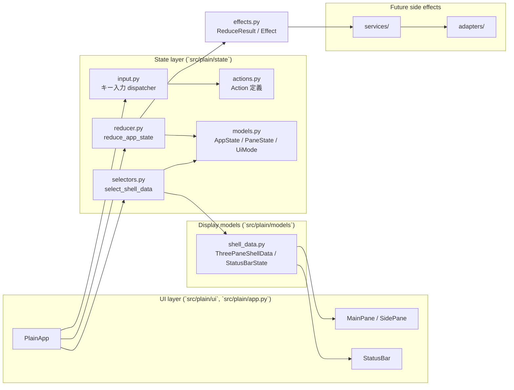
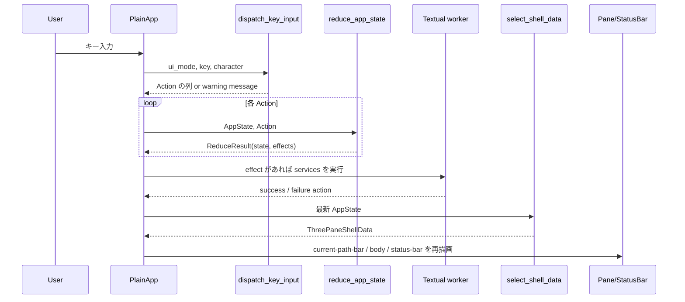
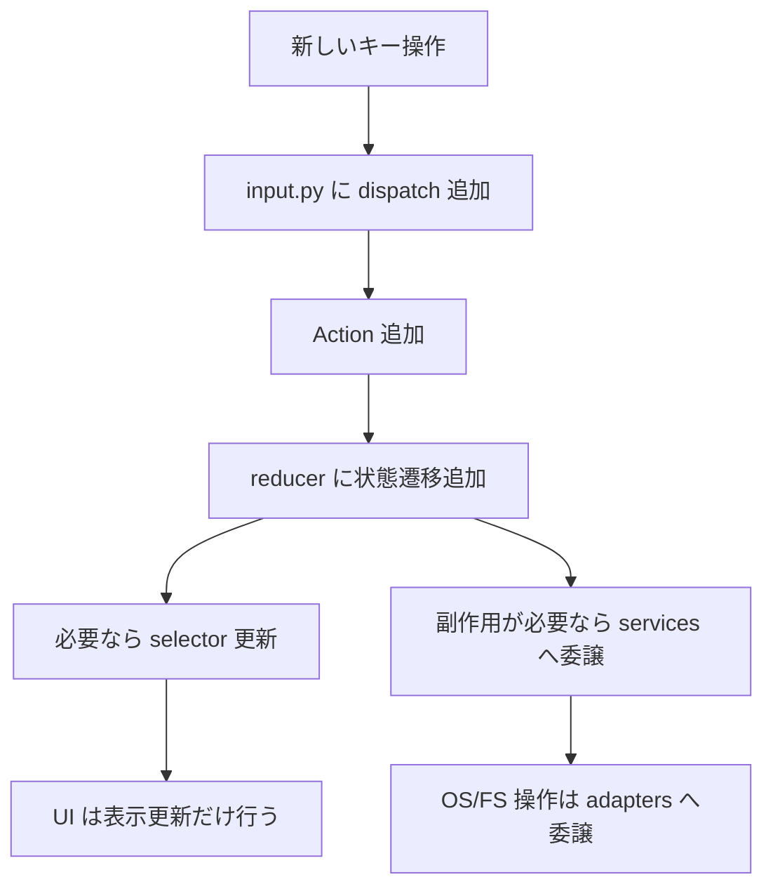

# Plain アーキテクチャ概要

このドキュメントは、現在の `Plain` の実装構造を俯瞰するためのものです。  
MVP 仕様全体ではなく、`2026-03-22` 時点でコード上に存在する責務分割とデータフローを対象にします。

## 1. 目的

現在の実装は、以下を明確に分離する方針で組まれています。

- `UI`: 表示と Textual イベント受け取り
- `input dispatcher`: キー入力を `Action` に正規化
- `reducer`: `AppState` を純粋関数で更新
- `selectors`: `AppState` を表示用モデルへ変換
- `models`: 表示モデルと状態モデル
- `services/adapters`: 副作用や OS / filesystem 依存処理の受け皿

## 2. 全体構成



## 3. キー入力から描画までの流れ

現在の中核フローは「入力 -> Action -> 状態更新 -> Effect 実行 -> Selector -> 再描画」です。



## 4. ディレクトリ責務

### `src/plain/app.py`

- `PlainApp` がアプリ全体の組み立て役
- Textual の `Key` イベントを受ける
- `dispatch_key_input()` と `reduce_app_state()` を呼ぶ
- reducer が返した effect を Textual worker で実行する
- selector の結果を使って UI を再描画する

### `src/plain/ui/`

- `CurrentPathBar`, `MainPane`, `SidePane`, `StatusBar` は表示責務に限定
- widget 自体はキー意味の分岐を持たない
- 現在の入力解釈は app / state 側で一元管理する

### `src/plain/state/actions.py`

- reducer が受け取る入力単位を定義する
- 現在は次のような Action がある
  - UI モード変更
  - カーソル移動
  - 選択トグル
  - フィルタ開始 / 確定 / 取消し
- 通知更新
- browser snapshot 読み込み成功 / 失敗
- child pane 読み込み成功 / 失敗

### `src/plain/state/input.py`

- `ui_mode` ごとに同じキーの意味を切り替える
- `BROWSING`, `FILTER`, `RENAME`, `CREATE`, `CONFIRM`, `BUSY` の入力をサポート
- 未サポート入力は warning message に変換する

### `src/plain/state/reducer.py`

- `AppState` を純粋関数で更新する
- 副作用を直接持たず、`ReduceResult(state, effects)` を返す
- カーソル移動時に child pane の再取得要否を決める
- full snapshot と child snapshot の stale 結果を request id で破棄する

### `src/plain/state/selectors.py`

- `AppState` を UI 用の `ThreePaneShellData` に変換する
- 中央ペインにはフィルタと現在の sort を適用し、親・子ペインは固定の名前順で整形する
- 中央ペイン要約、ステータスバー通知、ヘルプ行、入力バーの表示文字列をここで組み立てる

### `src/plain/models/`

- `shell_data.py` は描画専用モデル
- `state/models.py` は reducer 管理対象のアプリ状態
- `services/browser_snapshot.py` は 3 ペイン snapshot の組み立てを担う
- `adapters/filesystem.py` はローカル filesystem から `DirectoryEntryState` を構築する

## 5. 現在のモードと入力境界

```mermaid
stateDiagram-v2
    [*] --> BROWSING
    BROWSING --> FILTER: /
    BROWSING --> RENAME: F2
    BROWSING --> PALETTE: :
    PALETTE --> CREATE: Enter on create command
    PALETTE --> BROWSING: Esc
    FILTER --> BROWSING: Enter
    FILTER --> BROWSING: Esc
    RENAME --> BUSY: Enter
    CREATE --> BUSY: Enter
    RENAME --> BROWSING: Esc
    CREATE --> BROWSING: Esc
    CONFIRM --> BROWSING: Esc / Enter
    BUSY --> BROWSING: 完了時

    BUSY --> BUSY: 任意キーは無視
```

補足:

- `BROWSING`
  - `Up`, `Down`, `Left`, `Right`, `Enter`, `Backspace`, `F5`, `Space`, `Esc`, `/`, `Delete`, `F2`, `:` を処理
- `FILTER`
  - 文字入力、`Backspace`, `Space`, `Enter`, `Esc` を処理
- `PALETTE`
  - 文字入力、`Up`, `Down`, `Backspace`, `Enter`, `Esc` を処理
- `RENAME`, `CREATE`
  - 入力バーで名前編集し、`Enter` で rename/create を実行、`Esc` で cancel
- `CONFIRM`
  - paste conflict の解決、または複数対象削除の confirm/cancel を受け付ける
- `BUSY`
  - 非同期の directory load / file mutation 中は入力を抑止する

## 6. 現在できること / まだできないこと

### できること

- `CWD` を起点に実ファイルシステムの 3 ペイン UI を起動
- 可視行のカーソル移動
- 親/子ディレクトリへの移動と再読み込み
- 選択トグルと全解除
- フィルタ入力と再帰フラグ切り替え
- 単一対象の rename
- ゴミ箱への削除
- 新規ファイル / ディレクトリ作成
- コマンドパレット表示と create 系コマンド実行
- モード別キー解釈
- 入力バーによる rename/create 編集
- 画面上部へのカレントパス表示
- ステータスバーへの warning / error 通知表示
- child pane の必要時のみ再取得

### まだできないこと

- ファイル open
- 履歴移動や sort 切り替えの UI 操作

## 7. 今後の拡張ポイント

将来の実装は、基本的に次の順で差し込む想定です。



この流れを守ることで、widget ごとの分岐追加を避けつつ、操作の追加を局所化できます。
